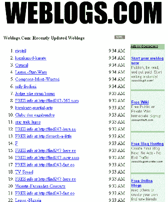
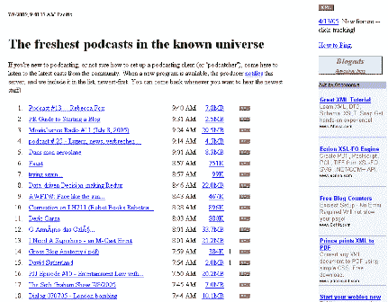

# 简介–Weblogs.com(Ping 服务器)

> 原文：<https://web.archive.org/web/http://www.techcrunch.com:80/2005/07/08/profile-weblogscom-ping-server/>

**服务:**【Weblogs.com】T2

**投放:** 1999 年

**什么事？**

Weblogs.com 是第一家博客 ping 服务公司，并且仍然是最大的。

**什么是 ping 服务？**

ping 服务是一种从博客(和其他来源)获取“ping”的服务器。ping 的目的是通知 ping 服务器源已经添加了新内容。这是与其他 ping 聚合在一起的，如果 ping 服务器是开放的，数据就可供第三方使用。第三方能够访问 ping 的源和时间的 URI。

Ping 服务不经常被讨论。没什么可看的(动作在 xml 数据中)，而且到目前为止他们还没有对他们的服务收费。然而， ping 服务器是博客世界基础设施的支柱，也是实时网络中至关重要的一部分。

原因如下:Ping 服务器位于搜索引擎和博客之间。没有 ping 服务器，像 feedster、technorati 和 pubsub 这样的搜索引擎就不知道博客和其他内容源是否以及何时更新。他们必须定期对这些网站进行索引，以了解它们是否已经更新。有超过 10，000，000 个博客，每小时重新索引将是一项巨大的任务——每几分钟，不可能。相反，只有当源通知 ping 服务器它已经更新时，它们才重新索引。对于实时网站来说，保持“实时”是一种更有效的方式，在发布和索引之间只有几分钟的延迟。

今天有许多 ping 服务器(列表见下面的链接)，但 Weblogs.com 是第一个，也是迄今为止最大的，因为它内置于几乎所有的博客软件中。
 **Weblogs.com:**

戴夫·温纳于 1999 年创建了 Weblogs.com，作为一种网络日志索引服务。[他在 2001 年 11 月重新启动了 ping 服务器](https://web.archive.org/web/20220701222029/http://archive.scripting.com/2001/11/01)(参见[这里](https://web.archive.org/web/20220701222029/http://newhome.weblogs.com/timelineForTransition))，因为博客开始增长，超出了定期重新索引的可行范围。

今天，Weblogs.com 每天接收超过 100 万个 pings。

Weblogs.com 有一个开放的后端，允许任何人访问它的数据。

**使用 Weblogs.com:**

要 ping weblogs.com，一个站点发送一个简单的 XML-RPC 消息到 rpc.weblogs.com，端口 80，路径/RPC2。这包括提要名称(博客或其他来源的名称)和 URL。

要访问 ping 数据，第三方可以访问两个版本:【weblogs.com/changes.xml】[显示最近一小时的数据，](https://web.archive.org/web/20220701222029/http://www.weblogs.com/changes.xml)  显示最近五分钟的数据。

更多完整的信息，请看 Weblog.com XML-RPC 接口文章[这里](https://web.archive.org/web/20220701222029/http://www.xmlrpc.com/weblogsCom)。

**音频。Weblogs.com:**

audio.weblogs.com 是一个播客平服务。它与 weblogs.com 非常相似，但也包括额外的数据:

–播客的大小
–播客的 xml 提要
–链接的点击数(排名或受欢迎程度特征)

ping 和访问 audio.weblogs.com 数据与普通的 weblogs.com ping 服务类似。

**链接:**

[weblogs.com](https://web.archive.org/web/20220701222029/http://www.weblogs.com/)

Technorati 标签:[weblogs.com](https://web.archive.org/web/20220701222029/http://www.technorati.com/tags/weblogs.com)，[达维温纳](https://web.archive.org/web/20220701222029/http://www.technorati.com/tags/davewiner)，[温纳](https://web.archive.org/web/20220701222029/http://www.technorati.com/tags/winer)，[平服务器](https://web.archive.org/web/20220701222029/http://www.technorati.com/tags/pingservers)，[平服务器](https://web.archive.org/web/20220701222029/http://www.technorati.com/tags/pingserver)， [techcrunch](https://web.archive.org/web/20220701222029/http://www.technorati.com/tags/techcrunch) ， [web2.0](https://web.archive.org/web/20220701222029/http://www.technorati.com/tags/web2.0)