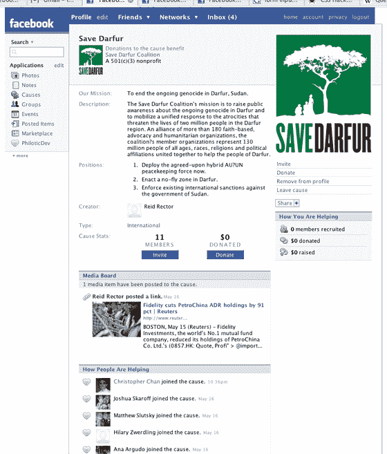

# 脸书发布原因| TechCrunch

> 原文：<https://web.archive.org/web/http://www.techcrunch.com:80/2007/05/24/project-agape-launches-via-facebook/>

我们在 3 月下旬写了一篇关于 Project Agape 的文章，这是一家将病毒原则应用于利他主义和社会公益事业的初创公司(“Project Agape”是这项服务的工作名称，尚未正式命名)。今天，这项服务作为 Facebook 平台的首批合作伙伴之一推出。

该公司由肖恩·帕克和乔·格林创建，旨在帮助社会事业——慈善机构、宗教、政党和候选人等。

与脸书的整合非常非常深入，考虑到创始人与脸书创始人兼首席执行官马克·扎克伯格的关系，这并不奇怪。帕克是脸书的首任总统，格林是扎克伯格的大学室友。

脸书已经有了一个流行的“groups”应用程序，许多社会事业都被表示为一个组。然而，群组除了加入之外，不允许用户做更多的事情。有了 Agape，用户可以创建事业，接受捐赠，招募成员。每当有人创建或加入一个原因，它会显示在他们的新闻供稿，让他们的朋友看到。关于原因的信息也包含在配置文件本身中，包括该用户筹集的总金额和招募的新用户。

还有一个多层次的营销方法。你招募的其他用户捐赠的任何款项也包括在你的“筹款”总额中(见上图)。通过招募成员和获得捐款来获得地位，不仅会极大地激励用户加入他们强烈感兴趣的事业，还会让他们持续参与其中。

我与格林和帕克交谈，问他们为什么决定通过脸书首次向公众展示他们的服务，而不是在他们自己的网站上推出。答案是:脸书拥有庞大而活跃的用户群(2000 万用户，每人每天在脸书上浏览 50 页)，他们非常有可能想要积极参与他们所信仰的事业。他们说，脸书团体的超高人气就是证据。

