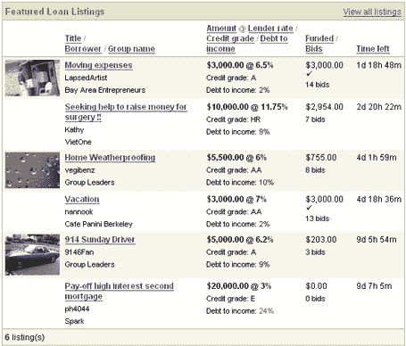

# Prosper 推出-社会贷款 

> 原文：<https://web.archive.org/web/http://www.techcrunch.com:80/2006/02/05/prosper-launches-social-lending>

# Prosper 推出–社会贷款

  总部位于三藩市的 [Prosper](https://web.archive.org/web/20221207145437/http://www.prosper.com/) 今天推出(Prosper 在其隐身阶段被[称为 Circleone](https://web.archive.org/web/20221207145437/http://www.beta.techcrunch.com/2005/10/27/circleone-rumored-to-launch-soon/) )。

像总部设在伦敦的(并由基准基金资助的)Zopa 一样，Prosper 也是借款人和贷款人的市场。

个人借款人说他们需要借多少(最多 25000 美元)和他们将支付的最高利率。感兴趣的贷方说他们想借多少，以什么样的利率借。Prosper 将价格最低的贷款人组合成一笔贷款。

根据 Prosper 的说法，完成一笔贷款通常需要 2-4 天。然而，借款人可以要求加急贷款，这将采取符合最低要求的金额和利率的第一贷款人。

Prosper [收取](https://web.archive.org/web/20221207145437/http://www.prosper.com/public/help/topics/other-fees.aspx)多项费用，包括向借款人收取 1%的成交费，向贷款人收取 0.5%的年度贷款维护费。

Benchmark 资助了 Zopa 和 Prosper。其他 [Prosper 投资者](https://web.archive.org/web/20221207145437/http://www.prosper.com/public/about/management_team.aspx)包括 Accel、Fidelity 和 Omidyar。