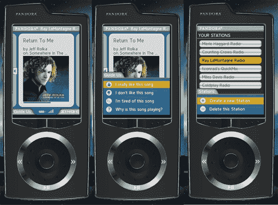
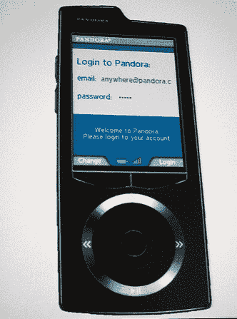

# Pandora Wifi 设备的原型今晚在旧金山展示 

> 原文：<https://web.archive.org/web/http://www.techcrunch.com:80/2007/05/23/prototype-of-pandora-wifi-device-shown-tonight-in-san-francisco/>

# 今晚在旧金山展示的潘多拉无线设备的原型

今晚，在旧金山现代艺术博物馆的媒体/用户活动上，潘多拉宣布了几个消息，我们之前已经报道过了。与 Sonos 和 Sprint 的交易宣布将潘多拉网络电台带入家庭和移动设备。

然而，他们也预先宣布了一款即将推出的 Wifi 音乐播放器，该播放器将由 SanDisk 制造，由 [Zing](https://web.archive.org/web/20230220010310/http://www.zing.net/) 驱动。首席技术官汤姆·康拉德(Tom Conrad)今晚演示的工作原型在物理上类似于雅虎上个月推出的 Sansa Connect 设备，尽管它稍微更长更薄。Sansa Connect 设备也由 Zing 供电。

没有透露多少细节，比如该设备是否会包括硬盘。包括一个硬盘驱动器会大大增加产品的成本，尽管它也允许在用户不在 wifi 覆盖范围内的时候缓存音乐。他们还可以捆绑一项服务，允许用户购买和下载类似的歌曲，尽管这也需要与第三方音乐服务合作。

下面的屏幕截图。我自己有几分钟时间玩这个设备，但我用拍照手机拍的照片很乱。我的目标是在不久的将来把其中的一些送给 TechCrunch 和 CrunchGear 的读者，即使我不得不自己闯进 Zing 的办公室去借。底部图片的照片归功于[布莱恩·考德威尔](https://web.archive.org/web/20230220010310/http://www.flickr.com/photos/briancaldwell/510425216/) ( [他的博客在这里](https://web.archive.org/web/20230220010310/http://eponymousx.com/))。

下图。点击顶部图片查看大图。
 

