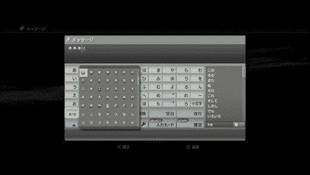

# PS3 1.90 固件发布:表情包！

> 原文：<https://web.archive.org/web/http://techcrunch.com/2007/07/23/ps3-190-firmware-released-emoticons/>

索尼刚刚在日本“放弃”了 PS3 的固件版本 1.90。现在随时都有可能到。变更日志显示，大部分改进只是表面上的，或者相当微小。不过，你现在可以在老 HDMI 上强制蓝光输出 24Hz。CD 音频输出现在也可以更改为 44.1/88.2/176/4kHz。你现在也可以在游戏中改变视频设置。不要再回到系统设置，而试图让图片看起来刚刚好。

或者，完整的列表

能够在 XMB
上重新排列游戏选项菜单现在包括“弹出磁盘”
按三角形弹出 XMB 中的游戏/CD/电影
XMB 背景
更改文件夹分类
表情符号
将 CD 输出更改为 44.1/88.2/176.4kHz
通过 HDMI 强制 24Hz 蓝光输出
更改游戏内 PS3 视频设置
“音乐设置”中的“位图” 更改设置，如在玩 PS 和 PS2 游戏时升级
添加书签
浏览器工具部分的网络浏览器安全功能
在音频视频聊天期间头像会移动

表情包！:)

[1.90 版本](https://web.archive.org/web/20150922193714/http://www.watch.impress.co.jp/game/docs/20070723/ps3.htm)【通过 [Kotaku](https://web.archive.org/web/20150922193714/http://kotaku.com/gaming/making-things-better/190-ps3-firmware-update-hits-japan-281191.php) 观看游戏】