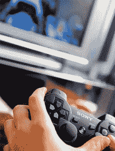

# PS3 在日本销量超过 Xbox 360 2:1

> 原文：<https://web.archive.org/web/http://techcrunch.com/2007/07/18/ps3-outsells-xbox-360-in-japan-21/>

# PS3 在日本销量超过 Xbox 360 2:1

“我不能那样做(不行！)”这句话可能正在微软高管们的脑海中回响，因为他们正在关注日本的 Xbox 360 销售情况。尽管任天堂的 Wii 仍然在世界各地销售强劲，销量超过 PS3 和 360，但索尼在旭日东升/触手可及的领域拥有优势。据日本游戏杂志出版商 Enterbrain 称，从 2006 年 11 月发布到 2007 年 7 月 15 日，索尼在日本售出了 101 万台 PS3。Xbox 360？不怎么热。从 2005 年 12 月(日本上市日期)到 7 月 8 日，仅售出 420，705 辆。

所以基本上，PS3 真的是有史以来最好的游戏机，至少在日本是这样。当然，Wii 的销量超过了它，但我打赌它比 PS3 更容易积灰！看起来日本人真的对电子游戏很有想法。坚持自己的根，但对长辈要尊重一些。

[Wii 在日本胜出](https://web.archive.org/web/20130628184116/http://www.reghardware.co.uk/2007/07/18/wii_wins_in_japan/)