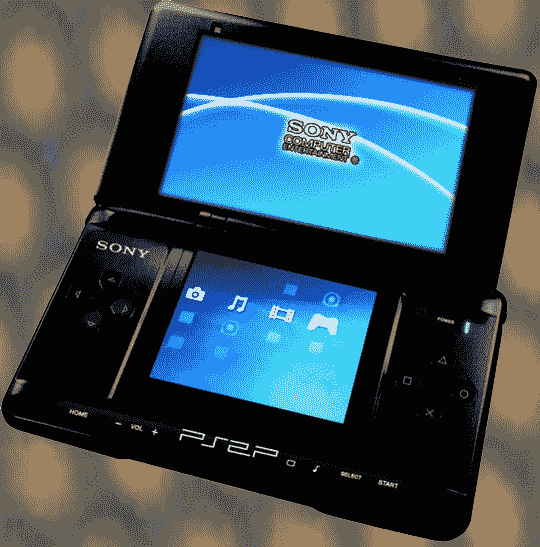

# PSP 2:第一张图片出现

> 原文：<https://web.archive.org/web/http://techcrunch.com/2007/07/11/psp-2-first-images-emerge/>

在 [MaxConsole](https://web.archive.org/web/20141020152514/http://www.maxconsole.com/) 的幸运儿不知何故在即将到来的 PSP 2 的一些泄露的照片上得到他们的肮脏，肮脏的手(不是上面的照片)，男人是一个旁观者！点击跳转来看看你自己！

是的，好的，它看起来就像现在的 PSP。但实际上，这是一个足够好的外形，很有意义。我们很想看到一些双屏幕的爱情，但嘿，我们不是索尼的发号施令者。如果是的话，他们的情况会好得多。不，真的。

[图为:新改版的 PSP](https://web.archive.org/web/20141020152514/http://www.maxconsole.net/?mode=news&newsid=18851)【MaxConsole】