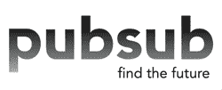

# PubSub:他们是 Baaaaack 

> 原文：<https://web.archive.org/web/http://www.techcrunch.com:80/2007/08/14/pubsub-round-two/>

 [PubSub](https://web.archive.org/web/20221127120114/http://www.crunchbase.com/company/pubsub) 去年的自爆当然比产品本身更为人所知。公司[开发了](https://web.archive.org/web/20221127120114/http://www.beta.techcrunch.com/2005/06/14/profile-pubsub/)他们称之为“未来搜索引擎”,允许用户输入关键词，并在博客和其他支持 RSS 的新闻发布时取回。

这是一个好主意，并且随着时间的推移，被大多数博客搜索引擎效仿。但该公司的创始人鲍勃·怀曼和萨利姆·伊斯梅尔从来没有相处过，他们的私人纠纷最终公开化。伊斯梅尔[在一场权力斗争后离开了公司](https://web.archive.org/web/20221127120114/http://www.beta.techcrunch.com/2006/03/07/pubsub-ceo-steps-down-acquisition-rumors/)，与 KnowNow 的合并破裂，公司[关闭](https://web.archive.org/web/20221127120114/http://www.beta.techcrunch.com/2006/06/06/pubub-implosion/)。即使在那之后，怀曼继续在他的博客上抨击伊斯梅尔。

今天，伊斯梅尔和怀曼继续前进。伊斯梅尔[领导雅虎砖房](https://web.archive.org/web/20221127120114/http://www.beta.techcrunch.com/2007/03/14/salim-ismail-to-head-yahoo-brickhouse/)，这是一个新的半自治业务部门，旨在促进雅虎内部的新产品开发。Wyman 在谷歌的一个内部项目中工作，有趣的是，这个项目也被称为 PubSub。

我以为我们已经听够了 PubSub 的故事。但是今天伊恩·贝尔发来电子邮件说公司正在重新启动——果然一个新的主页出现了。贝尔说，PubSub 的投资者在一次有争议的资本重组后接管了该公司，使一些小股东蒸蒸日上，他们已经将大部分资产出售给了他的创业公司，以及 100 万美元的新资本。他现在负责 PubSub。

贝尔表示，他们将在六个月左右重新推出 PubSub，作为“雅虎 Pipes 的消费者友好版本”由于他现在不会说更多，我们只能猜测到底会是什么，以及 PubSub 的技术如何融入其中。与此同时，他说，他们将在下个月推出一个直接使用 PubSub 匹配引擎的脸书应用程序。你告诉应用程序你喜欢什么，它就会给你提供相关的新闻和信息。
 **就是不看地毯下面的**

所有与原 PubSub 传奇有关的嫌隙还没有完全解决。我们听说，少数股东对 Polygon Capital 处理 KnowNow 合并讨论和最终关闭公司的方式非常不满。最终，Polygon 和他们的合伙人应该拥有公司的所有资产，而创始人和少数股东一无所有。Polygon 从未与他们解决此事，鉴于该公司处于不稳定状态，也没有理由起诉。但是，如果新的 PubSub 成功了，可能会突然有一大笔钱来追逐，这可能会引发老股东新的诉讼兴趣。

无论发生什么，这场戏剧很可能会继续下去。贝尔说，所有这些关注对他的新公司来说是“很好的公关”。

**更新:**贝尔在下面说[我在上面最后一段稍微引用错了他的话，鉴于我糟糕的听力，这是极有可能的。我认真对待误引，因为真正重要的(通常)是某人想说什么，而不是他们实际说了什么。在这种情况下，可能两者都不是。抱歉。](https://web.archive.org/web/20221127120114/http://www.beta.techcrunch.com/2007/08/14/pubsub-round-two/#comment-1556622)