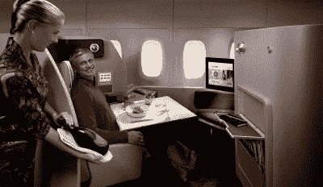

# 澳航升级机队，现在包括电力和无线网络| TechCrunch

> 原文：<https://web.archive.org/web/http://techcrunch.com/2007/07/27/qantas-upgrades-fleet-now-includes-power-and-wi-fi/>

如果美国国内航空公司像澳航一样具有前瞻性思维，我们的情况会好得多。至少极客们会。当然，你可以使用 [SeatGuru](https://web.archive.org/web/20160318060346/http://www.seatguru.com/) 来找出哪些座位有插座，或者拿出你的 Maglite 来检查一下，但是如果每个班级的每个座位都有电源和 Wi-Fi，不是更容易吗？

澳航宣布，从明年 8 月开始，新的空客 A380s 系列将安装电源插座，现有的波音 747-400 机队将改装一个“高级经济舱”来提供电源插座，但你必须等到 2 月。

更好的是，每节课都将提供 Wi-Fi，如果你忘了带笔记本电脑，也不用担心，因为飞机上的娱乐设备将提供网络和电子邮件接入。当然，班级之间会有一些差异，那些坐在前排的傻瓜将会使用 USB 来观看飞行中的娱乐内容，给电池和调制解调器端口充电。

无线数据也将提供给 GSM 手机。价格仍未确定，但“座椅靠背即时消息可能为 5 美元，可在航班上无限制使用，网络电子邮件将为每次航班 8 美元，附件额外收费，并将有一定的互联网接入措施。笔记本电脑用户可以通过 Wi-Fi 接入互联网和虚拟专用网。

那么连接会有多快呢？不幸的是，它将是微不足道的 432Kbps，这并不意味着如果其他人都在使用它，你会很时尚。令人失望，但它比外面的任何东西都好，所以不要抱怨！

[飞行中的互联网再次复活:澳航在所有班级引入无线宽带、笔记本电脑电源](https://web.archive.org/web/20160318060346/http://apcmag.com/6748/qantas_to_introduce_wireless_internet_in_all_classes_laptop_power_in_p)