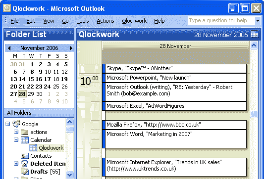

# Qlockwork 跟踪您的时间和注意力，并将其存储在 Outlook 中。TechCrunch

> 原文：<https://web.archive.org/web/http://techcrunch.com/2006/11/20/qlockwork-tracks-your-time-and-attention-and-store-it-in-outlook/>

我最近听说 Qlockwork 是来自 [workingProgram](https://web.archive.org/web/20160306014138/http://www.workingprogram.com/) 的 Outlook (2003/2007)的一个新插件，它能自动跟踪你的注意力，帮助你更有效地控制和计算时间。

与基于计时器的系统不同，一旦安装，Qlockwork 会自动记录你每天每 5 分钟的时间，所以你不需要记得启动计时器。Qlockwork 在后台工作，跟踪几乎所有的 Windows 应用程序，包括:MS Office，Internet Explorer，Firefox，MSN Messenger，Skype 等等。

注意力元数据是一个我非常感兴趣的话题，在过去的 12 个月里，已经有很多公司开发了记录注意力元数据的应用程序。例如[RootNet](https://web.archive.org/web/20160306014138/http://www.root.net/)[TouchStone](https://web.archive.org/web/20160306014138/http://www.techcrunch.com/2006/07/28/touchstone-brings-attention-data-to-life-in-real-time/)，Attensa， [RootVault](https://web.archive.org/web/20160306014138/http://majestic.typepad.com/seth/) ， [GestureLab](https://web.archive.org/web/20160306014138/http://www.gesturelab.com/) ， [LastFM](https://web.archive.org/web/20160306014138/http://www.last.fm/) 等。除了 LastFM，这些公司中的大多数都专注于捕捉注意力元数据，以便提供更好的 1:1 广告。另一方面，Qlockwork 是我所知道的第一家为了提供更好的时间管理和报告而捕捉人们注意力元数据的公司。

很快将会有一个 Qlockwork:Team，它将你的团队的个人活动日志汇集在一起，给你一个整体项目和时间花费的视图。

如果你有兴趣了解更多[请参观](https://web.archive.org/web/20160306014138/http://www.workingprogram.com/qwwalkthru1.html)或[下载 30 天试用版。](https://web.archive.org/web/20160306014138/http://www.workingprogram.com/qwdownload.html)

最后，Qlockwork 还提供了大量 HTML 或 CSV 格式的报告。下面是我今天早上时间的一个快速总结。此外，还有详细的故障报告，显示我在每个应用程序中关注的地方。

## Qlockwork 报告—
应用程序摘要

|  |
|  | (68%)
Mozilla Firefox——1 小时 55 分钟 |
|  | (6%)
微软 Outlook(阅读)——0 小时 10 分钟 |
|  | (18%)
Skype。全世界可以通话…–0 小时 30 分钟 |
|  | (6%)
GameHub.exe——0 小时 10 分钟 |
|  | (3%)
Windows 资源管理器——0 小时 05 分钟 |

使用电脑的总时间:2 小时 50 分钟