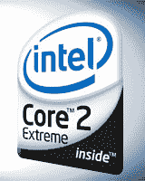

# 四核即将到来——TechCrunch

> 原文：<https://web.archive.org/web/http://techcrunch.com:80/2006/08/17/quad-core-is-on-the-way/>

以为两个内核就够了？它不是。真的。英特尔今天证实，他们将在这个假期发布一款 2.67 GHz 的四核酷睿 2 至尊处理器。流口水了吗？

该处理器被命名为 Kentsfield，将在一个封装中托管两个双核 Conroe 内核。处理器将得到增强，将其 L2 缓存从 4MB 增加到 8MB，这将使多任务处理更加无缝。当然，所有这些修改都会增加瓦数，但只是增加到 110 瓦左右——这比英特尔为其奔腾号飞船提供的功率略高。这些处理器仍将使用 975X 芯片组和 FSB1066，尽管没有提到插槽。

四个内核，更高的缓存，比旗舰 AMD 处理器更低的功耗？我加入。

[英特尔路线图确认 2.67 GHz 四核酷睿 2 至尊](https://web.archive.org/web/20210228033524/http://www.tgdaily.com/2006/08/17/core_2_extreme_quad_confirmed/)【TG daily】