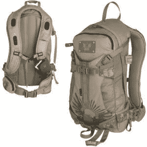

# 解渴你的 iPod

> 原文：<https://web.archive.org/web/http://techcrunch.com:80/2007/02/08/quench-your-ipod-thirst/>

骆驼肉水合包非常适合计划寻找国宝或圣杯的科技爱好者。生存包有一个 100 盎司的储水单元和一把铲子的空间。

为 21 世纪考古学家升级的骆驼背在上部肩带中还有两个 60 毫米防水扬声器。扬声器与任何具有 3.5 毫米插孔的音频设备兼容，如 iPod。通过[链接技术](https://web.archive.org/web/20220617235907/http://www.skullcandy.com/linkDetail.php?urlLocation=link)，用户还可以同时使用他们的手机和 iPod。音量和免提电话通话由位于中间表带上的软触摸板控制，音频来自表带下的小型麦克风。

250 美元的包装并不便宜，但它保证会给你的寻宝者和盗墓者留下深刻印象。

[camel bak Hellion 100 盎司头骨糖水合包](https://web.archive.org/web/20220617235907/http://www.backcountry.com/store/CAM0202/CamelBak-Hellion-100oz-Skull-Candy-Hydration-Pack.html?id=C8abBFMz)[[Talk 2 My Shirt](https://web.archive.org/web/20220617235907/http://www.talk2myshirt.com/blog/archives/119)via[Digg](https://web.archive.org/web/20220617235907/http://digg.com/gadgets/Camelbak_Skullcandy_Hydration_and_Audio_Backpack)