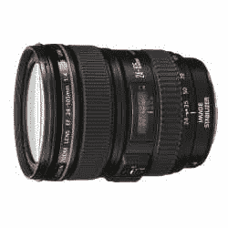

# 关于镜片的问题|技术危机

> 原文：<https://web.archive.org/web/http://techcrunch.com/2006/08/22/question-about-lenses/>

好吧，过去几个小时我一直在网上搜索佳能 EOS-30D 的最佳镜头。我的搜索结果喜忧参半，所以我想我会明白你们在这个问题上要说什么。基本上，我正在寻找一个镜头与极端的多功能性，如果我必须的话，一个单独的镜头，可以在低光环境下拍摄。很多人都知道闪光灯会破坏气氛，我更喜欢尽量少用闪光灯。那么，有学问的读者们，你们怎么看？