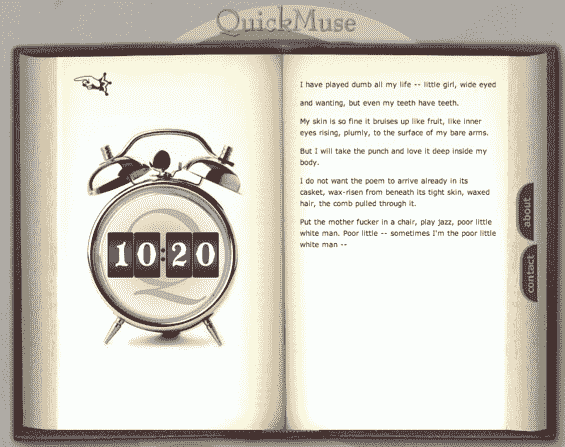

# QuickMuse:著名诗人抛弃

> 原文：<https://web.archive.org/web/http://www.techcrunch.com:80/2006/06/12/quickmuse-famous-poets-throw-down/>

 [QuickMuse](https://web.archive.org/web/20160404154123/http://quickmuse.com/) 是一个新网站，知名诗人在这里用 15 分钟的比赛来写出最引人注目的文字，灵感来自一句发人深省的艺术名言。现场活动已存档，所以你可以在滴答作响的时钟旁观看每一次按键，然后在网站的论坛上讨论这场比赛和诗歌。

看着伟大诗人分秒必争地写作时出现的停顿、删除、拼写错误和文字爆发是一件有趣的事情。

QuickMuse 吸引了一些高质量的诗人。第一场比赛，或者希腊人称为 agon，是在普利策奖获得者 Paul Muldoon 和 Thylias Moss 之间进行的，Thylias Moss 是 MacArthur Fellowship、Guggenheim Fellowship 和 Whiting 奖的获得者。第二场于上周举行，美国前桂冠诗人罗伯特·平斯基与多产作家朱莉安娜·巴戈特展开角逐。这个星期三将会看到玛吉·皮尔西写《争分夺秒》和乔纳森·加拉西。6 月 27 日，新共和国诗歌编辑格林·马克斯韦尔和西拉斯·莫斯将会登场。然后在 7 月 12 日，是卡罗尔·马斯克-杜克斯和凯文·杨。所有直播事件都发生在美国东部时间晚上 9:30，然后在网站上存档。

QuckMuse 是由肯·戈登(Ken Gordon)创建的，他是一名诗歌爱好者，也是一个关于犹太文学网站[JBooks.com](https://web.archive.org/web/20160404154123/http://jbooks.com/)的编辑。

