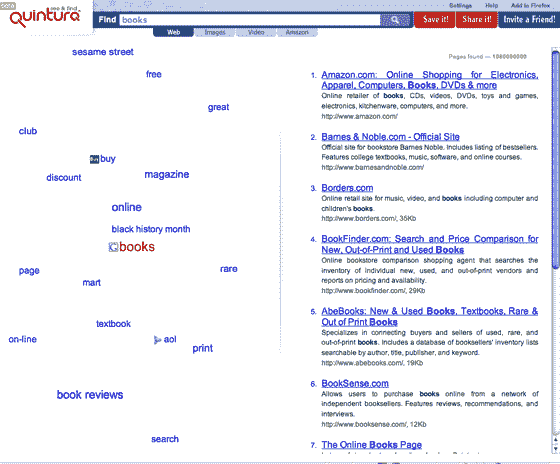

# Quintura 视觉搜索引擎重新推出 TechCrunch

> 原文：<https://web.archive.org/web/http://www.techcrunch.com:80/2007/02/26/quintura-search-engine-relaunches/>

# Quintura 视觉搜索引擎重新推出

  太平洋标准时间今天早上 8 点左右，总部位于莫斯科的搜索引擎 [Quintura](https://web.archive.org/web/20220926103549/http://www.quintura.com/) 将用新的用户界面重新推出它的视觉搜索引擎(如果它看起来像下面的屏幕截图，它就推出了)。

这家公司得到了红树林投资伙伴(Skype、AllPeers、Piczo、Nimbuzz)和 OpenView Venture Partners 的支持，已经开发出了一种技术，可以将相关的搜索词聚集到初始查询中，并以标签云的形式呈现出来。用户可以通过点击云中的任何一个词来细化他们的搜索——比其他词更近更大的词比其他词更与初始查询相关。将鼠标悬停在云中的任何单词上，也会显示与之相关的术语。

该公司去年明智地从可下载的搜索应用转向纯在线服务。新的界面将标签云移到左边，搜索结果移到右边——以前搜索结果在云的下面，看起来有些拥挤。该网站也有体面的图像和视频搜索，以及儿童安全搜索。

如果我要找一个特定的网站，谷歌或雅虎是完美的。像 [Clusty](https://web.archive.org/web/20220926103549/http://clusty.com/) 一样，我发现 Quintura 对于基于搜索的研究或浏览很有用，在这种情况下，我试图找到关于给定主题的更多信息。测试之后，我发现我已经回来使用过几次了。

