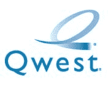

# Qwest 现在提供 EV-DO 服务| TechCrunch

> 原文：<https://web.archive.org/web/http://techcrunch.com/2007/05/22/qwest-now-offering-ev-do-service/>

Qwest 用户现在可以在旅途中获得一些像样的无线互联网。使用 Sprint 的 EV-DO 修订版 A 网络，Qwest 向用户提供价格过高的无线移动宽带计划。花 69.99 美元，你可以每月获得微不足道的 500 兆数据。据报道，Qwest 将提供 600MB 的套餐和无限量套餐，考虑到 500MB 和 600MB 在传输数据方面相差不远，这是没有意义的。

如果您目前正在使用 Qwest 的家庭宽带和电话服务，您有资格享受 20 美元的移动宽带服务折扣。当威瑞森和斯普林特都提供更便宜、同等的服务时，我不明白你为什么还要为奎斯特费心，但是，嘿，人各有志。

[Qwest 将移动宽带加入其产品](https://web.archive.org/web/20151013124945/http://www.phonescoop.com/news/item.php?n=2208)【电话独家新闻】