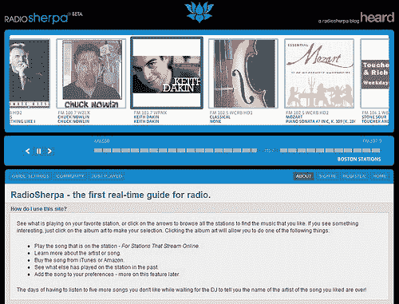

# 电台杀了视频明星？TechCrunch

> 原文：<https://web.archive.org/web/http://techcrunch.com/2006/11/14/radio-killed-the-video-star/>

好吧，电台不是*真的*杀人视频:)

几天前，有人向我介绍了[广播电台](https://web.archive.org/web/20160113100448/http://www.radiosherpa.com/)，这是广播电台和网络之间一个非常有趣的交集。这项服务是两个[麻省理工学院媒体实验室](https://web.archive.org/web/20160113100448/http://www.media.mit.edu/)毕业生萨沙·贾维德和[德瓦·西塔拉姆](https://web.archive.org/web/20160113100448/http://alumni.media.mit.edu/~deva/)的产品；顺便提一下，Deva 是开源手机运动的设计师之一。

RadioSherpa 向用户呈现波士顿地区的广播电台当前正在播放的曲目的实时轮播。点击“正在播放”的曲目，可以开始播放视频流，调出更多关于艺术家、歌曲或电台的信息，将曲目添加到个人资料中，或者点击亚马逊或 iTunes 上的购买内容。不幸的是，这项服务目前仅限于波士顿，并计划扩展到纽约和洛杉矶。有趣的是，RadioSherpa 也一直在提供高清电台的内容，让我们听众有机会在购买接收机之前体验高清。考虑到英国 DAB 发展过程中即将出现的[问题，这是推动高清采用的有效手段。](https://web.archive.org/web/20160113100448/http://technology.guardian.co.uk/weekly/story/0,,1942267,00.html?gusrc=rss&feed=20)

尽管 RadioSherpa 不在英国 TechCrunch 的“管辖范围”之内，但像 RadioSherpa 这样的服务(聚合和个性化广播内容和元数据)与英国尤其相关，这是有一些重要和令人信服的原因的。

BBC 将广播描述为一种*重新出现的*技术，这种技术正在英国经历某种程度的复兴，最近 [Ofcom 的报告](https://web.archive.org/web/20160113100448/http://www.ofcom.org.uk/research/cm/cm05/radio.pdf)证实收听数字正在超过电视——并且在英国人中占据相当大的份额。以下是来自英国广播公司 R & Mi 团队的一些事实

*   达到 90%——几乎无处不在。
*   10 个国家网络——比美国分散得多。
*   3250 万听众，平均每周收听 24 小时。
*   从 2003 年到 2004 年超过 76，000 小时的编程。
*   多种数字平台–DAB、互联网、数字电视。

事实上，R&Mi 在 BBC 广播内容方面的工作，如*十小时接管*，一直处于融合的前沿；将广播电台转移到一个更加社会化的媒体，将短信、电子邮件和网络作为回报丰厚的途径。BBC 正在寻求将[的 DAB 引入 iPod](https://web.archive.org/web/20160113100448/http://www.reghardware.co.uk/2006/08/11/bbc_promotes_bbc_dab_plan/) ，这并非巧合。

广播更喜欢大多数数字消费者的注意力受限的性质，以及各种媒体的自然“软”融合(而不是英国电信公司的人为多播放选项)。它在英国的无处不在和相对的市场凝聚力为创业公司提供了一个令人信服的机会，这些公司可以将内容、元数据和社区聚合成令人信服的新体验，也许特别是对于[新兴的小工具平台](https://web.archive.org/web/20160113100448/http://widgetslive.com/)。

为了利用这一潜力，英国广播业最好采取平台业务的姿态，就像亚马逊、谷歌或易贝一样。这类平台公开提供内容和元数据，可能会在广播社区、个性化收听、电子商务和广告领域掀起一波创新浪潮。受有利的使用趋势驱动，这只会增加无线电平台的价值。真正有帮助的是一个用于 Freeview 的 web API，让开发者和消费者至少可以访问 EPG 的数据——甚至是媒体！

我知道英国有一家公司在寻求做类似 RadioSherpa 的事情…但是我还不被允许谈论他们；)