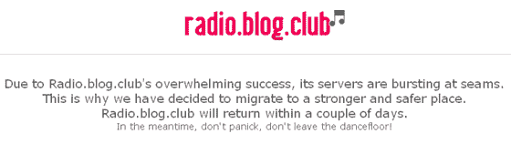

# RadioBlogClub 放弃旧海盗船，选择更大的船

> 原文：<https://web.archive.org/web/http://www.techcrunch.com:80/2007/03/14/radioblogclub-abandons-old-pirate-ship-for-bigger-one/>

# RadioBlogClub 弃旧海盗船换更大的

那些熟悉总部设在巴黎的电台博客俱乐部的人今天早上遭遇了服务中断。你可能还记得我们关于网络 iPod 模拟器 [Blogmusik](https://web.archive.org/web/20230321063217/https://techcrunch.com/2006/09/09/check-out-blogmusik-before-its-pulled-off-the-internet/#comments) 的评论，它也关闭了。音乐流媒体服务的流量已经突破了他们旧网络服务器的极限，他们正在转向一个更强大的服务器。很容易看出为什么。快速浏览一下 Alexa 的统计数据就可以看出它们在潘多拉星球上的大概位置。

虽然该网站的初衷是为音乐博客提供简单的歌曲流嵌入，但我感觉 RadioBlogClub 如此受欢迎是因为它也是获得免费音乐的一种简单方式。这项服务的工作原理是充当一个枢纽，将存储在各个会员网站上的音乐链接起来(有点像 [HypeMachine](https://web.archive.org/web/20230321063217/http://hypem.com/) 的反义词)。博客作者在上传他们的歌曲到他们的网站之前，通过一个转换器将他们的歌曲链接到他们的网站。转换器将 MP3 转换为该网站的 RBS 格式，并在数据库中注册歌曲。网站上注册的所有歌曲都可以单独播放，或者在主网站上用户生成的播放列表中播放，或者在像下面这样的嵌入式小工具中播放。

[http://stat . radioblogclub . com/radio . blog/skins/mini/player . swf](https://web.archive.org/web/20230321063217/http://stat.radioblogclub.com/radio.blog/skins/mini/player.swf)

虽然该网站不支持下载，但已经有[网站](https://web.archive.org/web/20230321063217/http://radioblogdownloader.com/)支持下载。这和我们发布自己的 [YouTube 电影下载软件](https://web.archive.org/web/20230321063217/https://techcrunch.com/2006/11/14/put-any-youtube-video-on-your-ipod/)并被贴上[撤下通知](https://web.archive.org/web/20230321063217/https://techcrunch.com/2006/11/15/huh-youtube-sends-techcrunch-a-cease-desist/)时 YouTube 吸取的教训是一样的。

它触及了我们在之前已经咆哮过的同样的内容控制问题[。任何流向您系统的内容都可能被捕获，DRM 系统有被破解的坏习惯。比尔·盖茨](https://web.archive.org/web/20230321063217/https://techcrunch.com/2007/01/10/the-inevitable-death-of-drm/)[对数字版权管理的现状](https://web.archive.org/web/20230321063217/https://techcrunch.com/2006/12/14/bill-gates-on-the-future-of-drm/)不满是可以理解的，史蒂夫·乔布斯公开呼吁[去死](https://web.archive.org/web/20230321063217/https://techcrunch.com/2007/02/06/apple-openly-supports-death-of-drm/)。音乐(电视/电影)行业需要一个新的快速收入模式([不是音乐税](https://web.archive.org/web/20230321063217/https://techcrunch.com/2006/11/19/replacing-drm-with-a-music-tax-is-incredibly-stupid/))。到目前为止，我们喜欢[李正吉街的](https://web.archive.org/web/20230321063217/http://www.google.com/url?sa=t&ct=res&cd=1&url=http%3A%2F%2Fwww.beta.techcrunch.com%2F2006%2F10%2F04%2Famie-street-takes-innovative-music-model-into-beta%2F&ei=Sqn4RfXVBo3egwPQnai1Bg&usg=__bguwnw6S-hCAyJyf5d5BFarrKi0=&sig2=GfjLRY-NrG0A4ddCocVg9Q)模式，尤其是他们的[免费裸女专辑](https://web.archive.org/web/20230321063217/https://techcrunch.com/2007/03/05/barenaked-ladies-new-album-free-no-drm-now/)。

法国 TechCrunch】披露了这个故事。

**更新**:*TCF 的 Ouriel Ohayon 报道，在法国版的 SACEM 的压力下，RadioBlogClub 已经被迫转移他们的主机提供商(目前是 OVH)。*