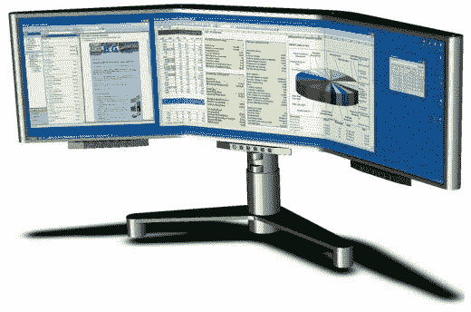

# Radius 320 无缝显示–TechCrunch

> 原文：<https://web.archive.org/web/http://techcrunch.com:80/2006/08/28/radius-320-seamless-display/>

# Radius 320 无缝显示

华尔街的人注意了:这是调出你的交易单、Drudge 报告、或者一场 FreeCell 或十二人游戏的绝佳时机。最重要的是，这款来自 SeamlessDisplay 的 50 英寸面板由三块 20.1 英寸的面板无缝粘合在一起，允许一些很酷的从左到右的窗口拖动动作。

有什么条件？您需要一个或多个支持三个 1600 x 1200 DVI 输出的卡。它可以在 Mac、Linux 和 Windows 下工作，不需要额外的驱动程序。还没有定价，但请放心，他们不会去玩《雷神之锤 4》盗版的人。

[商品页面](https://web.archive.org/web/20200806014246/http://www.seamlessdisplay.com/products_radius320.htm)【通过 [Gizmodo](https://web.archive.org/web/20200806014246/http://gizmodo.com/gadgets/peripherals/radius-320-seamless-display-look-ma-no-borders-196974.php) 通过 [BornRich](https://web.archive.org/web/20200806014246/http://www.bornrich.org/entry/radius-320-seamless-lcd-display-with-50-inch-diagonal-screen/) 无缝展示】