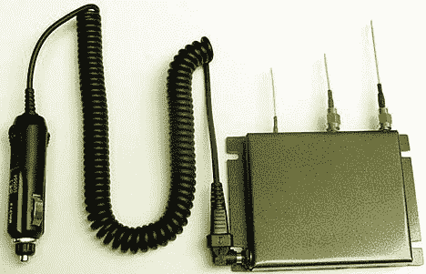

# 使用 DetectNu  的 GPS/GSM 干扰器制造麻烦

> 原文：<https://web.archive.org/web/http://techcrunch.com/2007/01/30/raise-hell-with-a-gpsgsm-jammer-from-detectnu/>

除了红绿灯转换器/MIRT(T2)，GSM/GPS 干扰器是我应该拥有的第二个设备，但不要拥有，因为我尽力不做一个混蛋。然而，如果我真的觉得自己有点像一个狡猾的混蛋，我可以从激进间谍装备制造商 DetectNu 订购这款 GSM/GPS 干扰器。

该设备直接插入汽车点烟器作为移动电源，旨在阻止周围地区的所有 GSM 和 GPS 信号。根据 DetectNu 的说法，这是为那些认为自己被 GSM 和 GPS 跟踪的极端偏执狂准备的。没有价格方面的消息，但可以直接通过 DetectNu 购买。

[GPS 和 GSM 干扰器](https://web.archive.org/web/20140519151420/http://www.navigadget.com/index.php/2007/01/29/gps-and-gsm-jammer/)