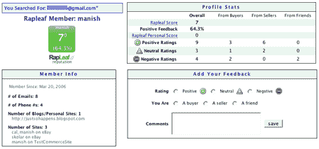
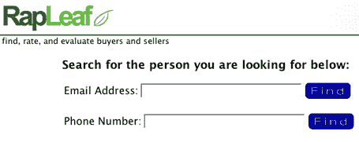
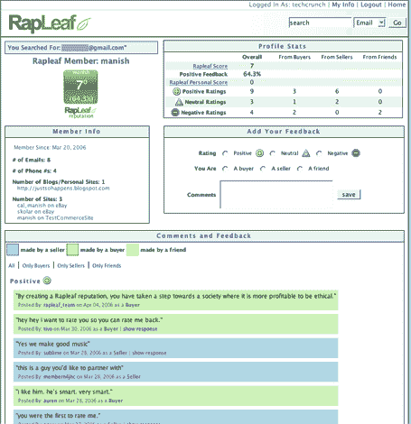

# Rapleaf 挑战 Ebay 反馈| TechCrunch

> 原文：<https://web.archive.org/web/http://www.techcrunch.com:80/2006/04/23/rapleaf-to-challenge-ebay-feedback/>

  易贝的反馈系统可以说是他们最有价值的资产。它提供了必要的油脂，让完全陌生的人能够舒服地互相买卖。但这是一个封闭的系统——只有易贝的交易才能影响用户的反馈分数。尽管易贝不喜欢这样，但这些用户(以及更多的用户)总是通过易贝以外的服务来买卖东西，无论是线上还是线下。对于第三方服务来说，将易贝的反馈系统整合到他们的应用程序中以使其更加有用有着巨大的需求。但是不要指望易贝会很快接受混搭，或者永远不会。

去年，我要求创建一个易贝反馈系统的开放版本。我还建议这个领域的 iKarma 对他们的产品进行改进，以适应这个更大的市场。但是直到现在，没有人正面解决这个问题。

进入由 Auren Hoffman 和 Manish Shah 创建的基于旧金山的新服务 Rapleaf，它是易贝反馈系统的完全开放版本。它还处于私人测试阶段，但是将会在 2006 年 5 月 7 日面向公众发布。

Rapleaf 允许任何人给与他们交易过的人留下反馈。其他人可以使用这些反馈来帮助他们确定他们是否在与可能参与欺诈的人做生意。 **Rapleaf 是易贝对网络和离线世界的反馈。**

关于 Rapleaf 有三件重要的事情需要了解——界面和基本功能集、欺诈预防和检测，以及它们的 API 集和相关策略。

## 界面和功能

Rapleaf 允许任何用户根据唯一的电子邮件地址或电话号码为任何人(无论他们是否是用户)留下反馈。在搜索栏中键入该标识符。如果没有结果，你可以第一个给那个人留下反馈。这个人可以是你一起买卖过的人，或者只是你想支持的朋友。像易贝一样，除了正面/中性/负面评价之外，还包括一个自由文本区用于评论。

一个人的反馈评级是一个原始分数，正面评价加一分，负面评价减一分(就像易贝一样)。非交易背书是单独计算和显示的。根据其他人的反馈评级，计算并显示各种统计数据(见下面的屏幕截图)。

## 欺诈预防和检测

易贝知道两个人什么时候交易过。这消除了许多欺诈问题(尽管易贝的一个大问题是用户出售数千件低价商品来抬高他们的反馈，然后用高价商品进行欺诈)。Rapleaf 不会有这种奢侈，所以他们专注于防止和检测系统中的欺诈行为。

首先，用户留下的任何反馈都可以被质疑。起初，这将由 Rapleaf 的员工处理。以后他们很可能会用第三方来处理纠纷。

Rapleaf 还将对所有反馈进行基于人和机器的分析，以寻找暗示欺诈的模式，特别是在提高反馈评级方面。一个用户可能每隔几个月就会得到一两个额外的分数而不会被发现。但联合创始人 Auren Hoffman 告诉我，他有信心他们能够发现任何大规模的欺诈企图，并关闭违规账户。

当然，他不会透露他的商业秘密，所以我无法判断他是否正确。但是如果他们已经解决了这个问题，这个他们面临的最大的问题，那么他们将会在取得成功的道路上走得很远。

## 开放，开放，开放 API

Rapleaf 将(在发布时)部署一个 API，允许第三方访问服务的关键部分。选择整合的第三方可以免费访问帐户创建、评论创建和反馈分数。对于非易贝的购物网站，Rapleaf 将是一个公平竞争的平台。如果随着时间的推移，有足够多的网站开始与 Rapleaf 整合，这些数据将变得比易贝的数据更加相关。

## 最后的想法

如果 Rapleaf 的计划成功，它将使互联网成为一个更好的做生意的地方。Rapleaf 不仅限于在线交易——没有理由认为线下发生的交易不能被 Rapleaf 衡量。标识符也可以是电话号码，这一事实告诉我 Rapleaf 已经在这样思考了。

业务发展将是 Rapleaf to nail 的重要领域。他们的 API 将在没有直接商业交易的情况下刺激无数的 mashups。但随着时间的推移，我也希望看到一些大型零售商、分类网站和购物引擎与 Rapleaf 整合。这将需要一个优秀的业务开发团队来寻找并完成这些交易。

 **附加截图:**

