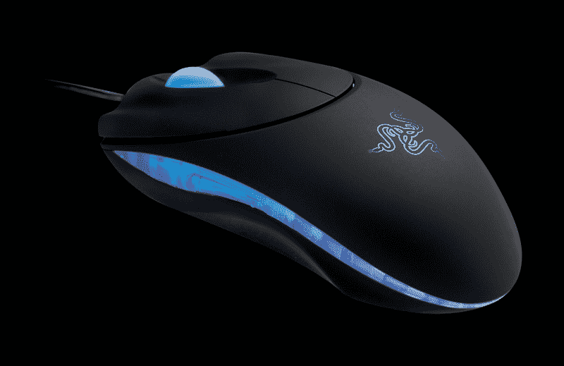

# Razer 将 Diamondback 升级到 3G

> 原文：<https://web.archive.org/web/http://techcrunch.com:80/2007/07/27/razer-upgrades-diamondback-to-3g/>

多亏了 Razer，游戏玩家的精确鼠标操作变得更好了。响尾蛇已经更新了雷蛇的第三代红外传感器~~，它使用了五个叶片而不是四个~~，现在它隐藏在一种新的防滑避孕套材料中，因为它的触感大大改善了，所以可以获得更好的响应时间。

> Razer 响尾蛇 3G 功能:
> 
> 1)1800dpi Razer Precision 3G 红外传感器
> 
> 2)七个独立可编程的超响应按钮
> 
> 3)动态灵敏度调整
> 
> 4)始终开启模式超大防滑按钮
> 
> 5) 16 位超宽数据路径
> 
> 6)每秒 6400 帧(每秒 580 万像素)
> 
> 7)高达每秒 60 英寸和 15g 的加速度
> 
> 8)带有 24 个单独点击位置的滚轮
> 
> 9)零噪音 Ultraslick 聚四氟乙烯支脚
> 
> 10)镀金 USB 连接器
> 
> 11)七英尺长、重量轻、不缠绕的绳索
> 
> 12)大致尺寸:128 毫米(长)x 70mm 毫米(宽)x 42.5mm 毫米(高)

热门的新 Razer 响尾蛇 3G 将于 8 月 1 日上市，售价 59.99 美元。

[新闻稿](https://web.archive.org/web/20160504164246/http://press.razerzone.com/content/view/232/101/)