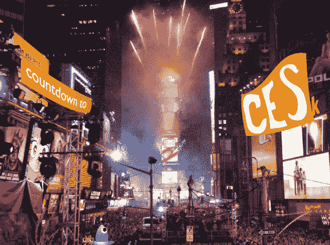

# 读者反应:CES 第一天倒计时

> 原文：<https://web.archive.org/web/http://techcrunch.com:80/2007/01/02/reader-response-countdown-to-ces-2/>

1 月 2 日快乐！你知道，我最近才习惯写 2006 年——现在是 2007 年。我想知道我是否能适应在七月的某个时候写下正确的日期。至少在 CrunchGear 上，WordPress 为我处理了日期。

我敢打赌，你们都在急切地等待每天的赢家，这很好，因为我有他们给你。两杯。一对幸运儿将每人带走一个[贝尔金钳形电涌保护器](https://web.archive.org/web/20161012015136/http://www.belkin.com/surgeprotection/concealed/)。那么谁是赢家呢？

在我们所有的标准审议之后，我们设法找到了今天的两个获胜者。他们是史蒂夫和保罗·古达斯。我会在这个星期的某个时候联系你们两个来得到你们的联系信息。

别忘了，本周我们还有一大堆由 Belkin 提供的奖品要送出。剩下的奖品是:

(2) [隐藏式电涌保护器](https://web.archive.org/web/20161012015136/http://www.belkin.com/surgeprotection/clamp%2Don/)
(1)[sport command](https://web.archive.org/web/20161012015136/http://crunchgear.com/2006/11/08/battle-test-belkin-sportscommand/)
(1)[N1 无线路由器和 ExpressCard 笔记本卡](https://web.archive.org/web/20161012015136/http://catalog.belkin.com/IWCatSectionView.process?Section_Id=203894)

奖品将按常规顺序发放。如果你想赢，只需评论本周的帖子。帖子出现频率和质量最高的评论者将获胜。请务必在评论信息表格中留下您的电子邮件地址。没有有效电子邮件地址的人不会赢。快乐评论！