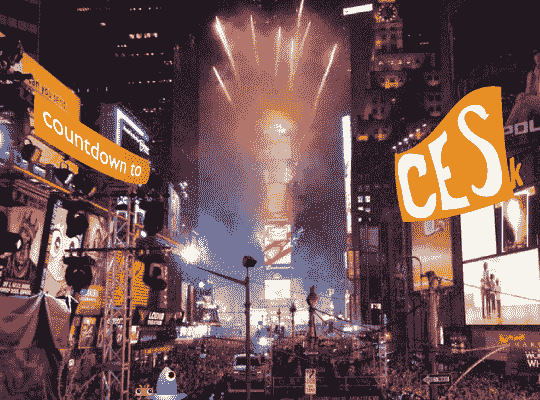

# 读者反应:CES 倒计时| TechCrunch

> 原文：<https://web.archive.org/web/http://techcrunch.com/2007/01/01/reader-response-countdown-to-ces/>

大家新年快乐。我希望每个人都有一个愉快的夜晚，并设法保持安全。我们目前正在努力摆脱我们的酒鬼，但半一致的张贴应该明天恢复。

无论如何，我已经为你们所有人准备好了最后一期(暂时)读者回应。读者反应:CES 倒计时。

Belkin 慷慨捐赠了大量奖品，我们将在周二——Fri 发放。奖品是:

(2) [钳形电涌保护器](https://web.archive.org/web/20160129154006/http://www.belkin.com/surgeprotection/concealed/)
(2) [隐藏式电涌保护器](https://web.archive.org/web/20160129154006/http://www.belkin.com/surgeprotection/clamp%2Don/)
(1)[sport command](https://web.archive.org/web/20160129154006/http://crunchgear.com/2006/11/08/battle-test-belkin-sportscommand/)
(1)[N1 无线路由器和 ExpressCard 笔记本卡](https://web.archive.org/web/20160129154006/http://catalog.belkin.com/IWCatSectionView.process?Section_Id=203894)

它们将按常规的顺序分发。如果你想赢，只需评论本周的帖子。帖子出现频率和质量最高的评论者将获胜。请务必在评论信息表格中留下您的电子邮件地址。没有有效电子邮件地址的人不会赢。祝评论愉快，再次祝新年快乐。