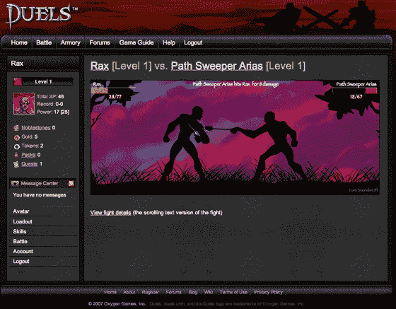

# 准备好消磨时间(和一些敌人)了吗？试试 Duels.com——TechCrunch

> 原文：<https://web.archive.org/web/http://www.techcrunch.com/2007/08/06/ready-to-kill-some-time-and-some-enemies-try-duelscom/>

# 准备好消磨时间(和一些敌人)了吗？试试 Duels.com

  [决斗](https://web.archive.org/web/20220522114331/http://www.duels.com/)是一款新的在线角色扮演游戏，我已经在这上面浪费了大半个晚上。这既是一个社交网络，也是一个角色扮演游戏——创造一个魔兽世界类型的角色，为他或她购买盔甲、武器等。，然后挑战其他玩家决斗。赢了你会得到经验，黄金和其他东西。输了，你什么也得不到。

创始人安德鲁·布西(前奥斯汀创业公司 Pluck 的联合创始人)表示，他希望创造一款游戏，让用户可以在 10-30 分钟内异步对战，但仍能以令人上瘾的方式推动角色前进。他做到了——当你向别人挑战决斗时，你设定了你想要如何战斗，但你不能控制决斗本身的行动。所以对手可以接受，即使你离线，决斗仍然会发生。最终的结果是魔兽世界和[魔法的合并:聚会](https://web.archive.org/web/20220522114331/http://en.wikipedia.org/wiki/Magic:_The_Gathering)。

每个用户也有一个个人资料，显示他们的统计数据，头像和战斗历史。其他用户可以被添加为竞争对手或盟友，和/或发表评论。

这个游戏令人上瘾而且有趣。它还没有正式推出，所以很少有用户战斗。然而，有许多游戏控制的对手已经准备好并等待着。

注意:像 [Kdice](https://web.archive.org/web/20220522114331/http://www.beta.techcrunch.com/2006/12/17/i-spent-sunday-evening-playing-kdice/) 、[桌面塔防](https://web.archive.org/web/20220522114331/http://www.beta.techcrunch.com/2007/06/08/desktop-tower-defense-spurs-startup/)和其他我们报道过的游戏一样，准备好损失几天时间来测试这个。

Duels 是游戏背后的母公司[挑战游戏](https://web.archive.org/web/20220522114331/http://www.crunchbase.com/company/challenge-games)的首款产品。

