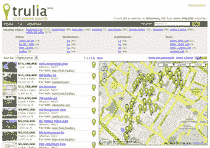

# 使用 Trulia | TechCrunch 进行房地产垂直搜索

> 原文：<https://web.archive.org/web/http://www.techcrunch.com:80/2005/10/30/real-estate-vertical-search-with-trulia/>

 [Trulia](https://web.archive.org/web/20230222044601/http://www.trulia.com/) 是一个房地产垂直搜索引擎。斯坦福大学工商管理硕士皮特·弗林特和萨米·因基宁于 2004 年创建了 Trulia，并刚刚将他们的十人公司搬进旧金山闪亮的新办公室。Trulia 目前获得了天使投资。

该网站于一个月前上线，仅提供加州的房源。Trulia 将在不久的将来推出新的州(下一个将在本周推出)。

像 Oodle 一样，Trulia 从多个分布式来源获取内容。在 Trulia 的案例中，其数据来自房地产专业人士的网站，那里有最详细的房屋列表信息。Trulia 经常有不包括在 MLS 中的列表，要么是因为代理尚未上传列表，要么是因为一些新的住宅建设，它们根本不会出现在 MLS 中。

该网站由广告商支持，与谷歌地图完美整合，并提供新搜索结果的电子邮件和 RSS 通知。我非常喜欢的另一个特性是统计数据。对于任何给定的搜索，Trulia 将显示每间卧室的平均房价统计数据(但由于某种原因，没有所有房屋列表的平均价格)，房屋在市场上的平均时间，每平方英尺的平均价格等。

Trulia 目前不显示所有者列表出售。除了提供丰富的用户体验，他们的主要目标是通过降低营销成本和增加网站流量来服务房地产专业人士。Pete 告诉我，从专业人员的网站上检索信息并不容易，必须对其进行正确的解析和格式化，以便在 Trulia 上重新显示，并删除重复的列表(一些网站显示来自第三方代理的列表)。