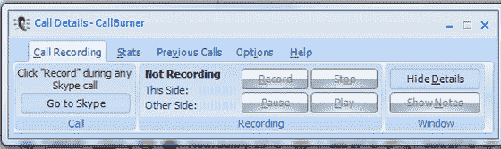

# 用 CallBurner 记录 Skype 通话 

> 原文：<https://web.archive.org/web/http://www.techcrunch.com:80/2007/06/08/record-skype-calls-with-callburner/>

# 用 CallBurner 录制 Skype 通话

 [CallBurner](https://web.archive.org/web/20230212095825/http://www.callburner.com/) 是来自 [Skylook](https://web.archive.org/web/20230212095825/https://techcrunch.com/tag/skylook) 背后的澳大利亚团队的一个新的独立 Skype 录音插件。

CallBurner 使用 Skylook 背后的技术来提供与 Skylook 相同的功能，而无需安装 Microsoft Outlook。CallBurner 客户端在一个简单的界面上提供专业的录音功能，将 Skype 通话直接录制成 MP3 或 WAV 格式，以获得更高质量的录音。

CallBurner 并不是第一款此类软件。CallBurner 给我留下深刻印象的是它是如何工作的:它完全像广告宣传的那样工作，而我以前尝试过的一些软件包很难和/或不稳定。

这不是自由软件；用户可以免费试用 14 天，然后收费 49.95 美元(仅限 Windows)，但对于大量 Skype 用户或通过 Skype 进行商务或采访的人来说，需要记录通话，这是值得支付的价格。
