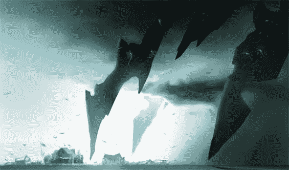

# 红 5 工作室的目标是成为在线游戏的皮克斯

> 原文：<https://web.archive.org/web/http://www.techcrunch.com:80/2006/12/11/red-5-studios-aims-to-be-pixar-of-onling-gaming/>

# 红 5 工作室的目标是成为在线游戏的皮克斯

  新网络游戏公司 [Red 5 Studios](https://web.archive.org/web/20220818081726/http://www.red5studios.com/) 的创始人今天庆祝从 Benchmark Capital 和 Sierra Ventures 获得 1850 万美元的融资。基准资本的比尔·格利将加入董事会。根据今年早些时候的一项游戏开发协议，该公司之前从 WEBZEN 筹集了营运资金。

红 5 工作室是由暴雪的魔兽世界背后的一些关键人物建立的，声称有超过 650 万用户。首席执行官马克·克恩告诉我，他们脱离暴雪是因为他们对下一代在线游戏的适当策略有不同的看法，他的目标是通过创作由他人分发和推广的游戏，使 Red 5 工作室成为“在线游戏的皮克斯”。期待他们在一年左右的时间里推出第一款游戏，最初是通过 WEBZEN。

克恩告诉我，如果你是顶尖的游戏人才，他们就会招聘。该公司还向我们发送了概念艺术品，我们已经包括在下面，因为它看起来绝对真棒。不知道这是否以及何时会被整合到游戏中。

