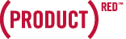
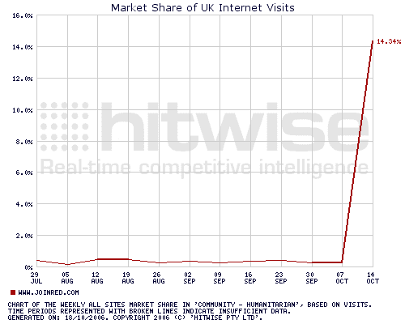

# 红色正在崛起

> 原文：<https://web.archive.org/web/http://techcrunch.com/2006/10/18/red-is-on-the-rise/>

[ Hitwise 英国](https://web.archive.org/web/20160423223156/http://www.hitwise.co.uk/datacenter/) 刚刚宣布 [RED](https://web.archive.org/web/20160423223156/http://www.joinred.com/) 在英国互联网访问中的市场份额增长了 70 倍，成为 Hitwise“社区-人道主义”类别中的第一网站，排名从第 73 位上升，这是[上周与 MySpace 一起推广](https://web.archive.org/web/20160423223156/http://uk.techcrunch.com/2006/10/09/myspace-gives-a-glimpse-to-the-potential-power-of-social-networks/)的直接结果。

> 上周，MySpace 占 Red 上游访问量的 89.5%，MySpace Mail 是访问量排名第二的推荐者，占网站访问量的 3.83%。

作为宣传活动的开始，MySpace 成员收到了来自 MySpace 联合创始人汤姆·安德森的两封电子邮件，鼓励他们成为红色的朋友。这封邮件将会员导向 RED 的 MySpace 简介，其中包含 RED 和其他相关网站的链接。

与红色相关的品牌似乎也从 MySpace 的推广中受益。[匡威](https://web.archive.org/web/20160423223156/http://www.converse.com/index.asp?bhcp=1)在线上周获得红人下游访问量 9.34%， [Gap](https://web.archive.org/web/20160423223156/http://www.gap.com/browse/home.do?cid=16591) 获得 7.9%，[美国运通](https://web.archive.org/web/20160423223156/http://www.americanexpress.com/pes/uk/benefits/red/microsite/index.shtml?sourcecode=X63692RD05) 2.16%。

> “RED 是 MySpace 上极其成功的推广的一个例子，它利用社交网络的力量迅速接触到庞大的消费者网络。品牌越来越关注社交网络，寻找吸引年轻受众的机会。RED 提供了一个最佳实践范例，展示了品牌如何以创新的方式在网上吸引消费者，同时为公益事业做出贡献。”Hitwise 英国公司的研究副总裁希瑟·霍普金斯说。

