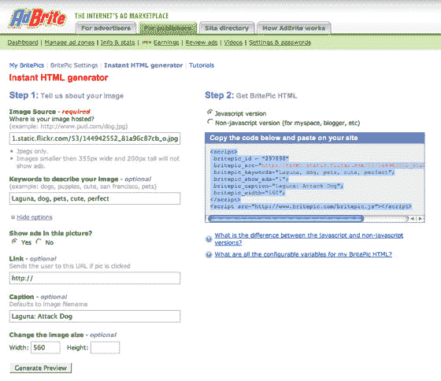

# 重新定义 IMG 标签 TechCrunch

> 原文：<https://web.archive.org/web/http://www.techcrunch.com:80/2007/03/29/redefining-the-img-tag/>

Brit epic _ id = " 297898 "
Brit epic _ src = " http://farm 1 . static . Flickr . com/53/144942552 _ 81a 96 c 87 CB _ o . jpg "；
britepic_keywords= "拉古娜，狗，宠物，可爱，完美"；
brite PICC _ show _ ads = " 1 ";
britepic_caption= "拉古娜:攻击狗"；
britepic_width="560 ";

从第一个图形网络浏览器开始，使用标签将图像嵌入网页的基本格式几乎和 HTML 本身一样悠久。它是有效的，而且经常被使用。但是还能更好吗？

广告网络 [AdBrite](https://web.archive.org/web/20230203091805/http://www.adbrite.com/) ，它总是[寻找新的方式来思考事情](https://web.archive.org/web/20230203091805/https://techcrunch.com/2007/01/04/adbrite-makes-brilliant-video-product/)，说它可以。今天早上，AdBrite 发布了 [BritePic](https://web.archive.org/web/20230203091805/http://www.britepic.com/) 来帮助人们围绕嵌入式图像添加许多新功能。只需更改嵌入代码，网络出版商就可以添加标题、水印、缩放、共享、调整大小和其他功能。和广告，如果他们愿意的话。

最终产品如上图所示。代替使用标准标签嵌入图像，例如:

> 

BritePic 只是使用了一段 javascript 代码(myspace、blogger 等也有非 javascript 版本。)和一个非常轻量级的 Flash 7 播放器来显示带有许多附加功能的图像。BritePic 有一个代码生成器工具(见文章底部的图片)，尽管所有的参数都在代码本身中，所以高级用户可以快速地写出它。下面是上图的代码:

以上任何参数都可以更改。当您注册 BritePic 时，如果您选择在图片中包含广告，您需要添加水印和支付信息。上面代码中的 id 告诉它要添加什么水印。BritePic 不托管图像文件，所以 src 字段告诉它从哪里提取图像。可以添加关键字(未来的功能将显示相关图片)，添加显示或不显示，添加标题，并重置宽度。

上图左下角的下拉菜单中也有许多功能。变焦是我的最爱。放大图片，查看该区域的大图。如果你正在使用一个大的图像和调整大小，将会有较少的像素化。但是，即使对于未调整大小的图像，缩放功能也会派上用场。在这个博客上，我们被限制在允许图片的水平空间，它将允许我们上传更大的图片，并允许人们放大，或者只需在新的页面上点击查看更大的图片。

该公司已经制作了一个演示视频，我们已经嵌入下面。

AdBrite 由 Philip Kaplan 和 Gidon Wise 创建。[公司的背景资料在这里](https://web.archive.org/web/20230203091805/https://techcrunch.com/2006/11/05/fuckedcompanys-adbrite-spawn-goes-20/)。

【http://vid.adbrite.com/video/abplayer.swf 号

