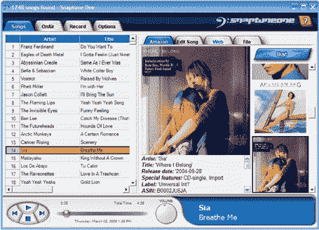

# 还记得把收音机录到磁带上吗？

> 原文：<https://web.archive.org/web/http://www.techcrunch.com:80/2006/03/05/remember-recording-radio-to-cassette/>

  今天经人介绍，我认识了新创公司 [SnapTune](https://web.archive.org/web/20160418194325/http://snaptune.com/) 的创始人之一比尔·巴克斯特。该公司将于本周上市。只需一点用户配置，Snaptune 就会自动将歌曲和其他内容直接从调频收音机下载到你的电脑上，并添加来自亚马逊和其他来源的元数据。

设置需要下载(现在只有 PC，所以我不得不拿出我的旧笔记本电脑)，并连接一个调频接收器到 PC(包括几乎任何通过线路输入的调频收音机)。该服务还显示歌曲信息，包括从亚马逊网站获得的信息。

> Snaptune One 可与大多数 FM 调谐器卡和 USB FM 设备配合使用，或者您可以简单地将 FM 收音机连接到 PC 上的 line-in 即可开始使用。一根简单的电缆不到 2 美元，您就可以立即开始使用 Snaptune，并开始发现源源不断的新音乐。有了 USB FM 调谐器，Snaptune 可以根据您定义的时间表为您调谐到不同的电台。
> 
> Snaptune One 几乎可以与世界上任何地方的任何广播电台合作。FM 电台进去，个人歌曲出来，就这么简单！
> 
> Snaptune One 还向您显示每首歌曲的信息、包含该歌曲的专辑、同一乐队的其他专辑、该歌曲在电台的受欢迎程度、该歌曲有多新、受欢迎程度是上升还是下降，以及来自 Amazon.com 的专辑的详细评论。只需点击几下鼠标，你就可以将任何你喜欢的专辑添加到你的 Amazon.com 购物车中。

根据比尔的说法，Snaptune 能够通过使用“高级信号处理和搜索技术”在音频流中找到完整的歌曲和其他内容。当我追问他更多的细节时，他以知识产权保护为由(这很公平)，没有让步，但补充说“这很有效，试试吧！”

嗯，我无法尝试，因为我今天找不到我的电脑的 USB FM 接收器(Fry's 出于某种疯狂的原因没有携带它们)。不过明天我会做更多的“研究”。比尔告诉我 CompUSA 有很多不同的品牌。

不过，根据其中一张[截图](https://web.archive.org/web/20160418194325/http://snaptune.com/snaptuneone/images/songs.JPG)，有一件事是肯定的——snap tune 将很好地从亚马逊和其他来源(包括用户创建的数据)获取歌曲的元数据。

一旦安装好硬件和客户端，您只需设置您喜欢的电台(如果您喜欢，还可以设置具体的广播时间)，Snaptune 就会自动为您下载音乐和元数据。这是一种音乐发现服务——就像 Pandora 一样，你告诉它你喜欢什么(在这种情况下，特定的电台和时间), Snaptune 就会根据这些信息为你选择音乐。虽然您可以使用现有的软件在您的计算机上录制 FM，但 Snaptune 会为您完成所有艰苦的工作，并保证歌曲的完整音频等。

对于免费帐户，您可以将多达 20 首 MP3 或 WMA 格式的歌曲移动到您的硬盘上。当然，您可以将这些内容移动到便携式设备上，刻录到 cd 上，等等。还将有一个高级帐户的选项，它将没有下载到硬盘驱动器/设备的限制。

对于付费用户来说，如果他们能建立一个 RSS 订阅源，并把每首歌作为附件包含进来，那就太好了。

Snaptune 的其他创始人包括马克阿泽顿、沃伦伯奇和伊恩·马瑟。该公司是自筹资金的(很快就会改变)，总部设在华盛顿的贝尔维。

正如我上面提到的，Snaptune 应该会在本周发布。要在它上线时得到通知，请在这里输入您的电子邮件。

这一领域现有的竞争对手包括[重播电台](https://web.archive.org/web/20160418194325/http://www.applian.com/replay-radio/index.php)和[广播时间](https://web.archive.org/web/20160418194325/http://www.radiotime.com/)。

注意:我正在试图弄清楚我是否比潘多拉更喜欢这个服务。它们都是发现新音乐的好方法。有了潘多拉，你可以立即得到满足，但如果不单独购买，你就无法保留你喜欢的音乐。我想我会两个都用。:-)

