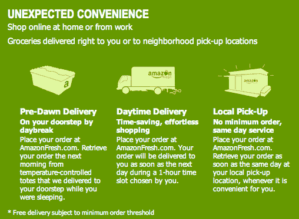

# 记得 Webvan 吗？亚马逊 TechCrunch 也是如此

> 原文：<https://web.archive.org/web/http://www.techcrunch.com:80/2007/08/01/remember-webvan-so-does-amazon/>

看看[Amazon Fresh](https://web.archive.org/web/20230131205713/http://fresh.amazon.com/)——亚马逊的一项新的邀请服务，看起来与典型的 90 年代互联网熄火服务 [Webvan](https://web.archive.org/web/20230131205713/http://en.wikipedia.org/wiki/Webvan) 非常相似。

这项新服务承诺以“有竞争力的日常价格”快速送货上门，包括新鲜农产品它目前只在西雅图可用，还没有正式宣布。但是至少有一个人看到一辆亚马逊生鲜卡车在西雅图市区行驶。

用户在网站上选择并支付食品杂货。然后，他们可以选择在当地自己取货，或者在最小订单量的情况下，在第二天的一个小时内送货上门。食品杂货也将装在温控集装箱里，在黎明前送到门口。

一年前，亚马逊开始尝试销售不易腐烂的食品和家庭用品，但没有直接送货上门，也没有易腐烂的商品。

如果你是西雅图的读者，把你的相机放在手边。我们想要一张运货卡车的照片。

Webvan 有着惊人的首次公开募股，并迅速扩展到 26 个城市，于 2001 年破产。在关闭之前，Webvan 已经收购了竞争对手 HomeGrocer。巧合的是，亚马逊是 HomeGrocer 的投资者。

