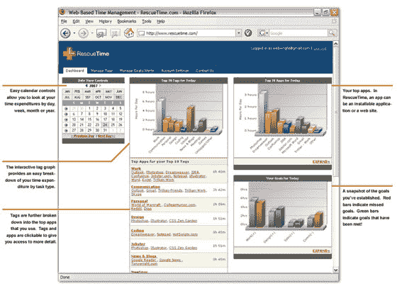

# 救援时间:自动化时间管理符合 Web 2.0 

> 原文：<https://web.archive.org/web/http://www.techcrunch.com:80/2007/05/04/rescue-time-automated-time-management-meets-web-20/>

# 救援时间:自动化时间管理符合 Web 2.0

时间管理作为一个分布式概念并不新鲜，从免费午餐(午餐通常是亮点)的长期公司培训日，到早期的软件包，甚至到今天，大量的 Web 2.0 选项专注于为用户提供更好地管理自己和团队成员时间的工具。

虽然这些年来我一直是许多软件包的用户，特别是最近的 [Basecamp](https://web.archive.org/web/20230203091857/http://www.basecamphq.com/) ，这些产品的结构主要依赖于用户的手动输入。在追求更有效地管理自己的时间时，你实际上是在用这些时间来输入你正在做的事情，而对我来说，这通常只会导致一件事:我没有足够的时间来输入数据和使用时间或项目管理工具。

总部设在西雅图的[救援时间](https://web.archive.org/web/20230203091857/http://www.rescuetime.com/)通过提供一种基于网络的个人时间管理服务，通过软件输入数据，实际上解决了必须将数据输入时间管理工具的问题。该软件可以随时跟踪你在电脑上做的事情，然后将数据上传到服务器供日后查看。

《拯救时间》的托尼·赖特告诉我,《拯救时间》的核心使命是让信息工作者以一种简单的方式理解他们如何度过时间。他在 2006 年将 [Jobby](https://web.archive.org/web/20230203091857/https://techcrunch.com/2006/03/27/the-jobby-experiment/) 卖给了 Jobster，现在正在进行他的第三次创业。“我们认为，了解你如何支配时间会让你更有效率，并促使你更有意识、更周到地支配时间”。

他提出了一个非常好的反问，我知道很多读者都会有同感:“每个信息工作者在结束一天的工作后都会问，‘我的一天到底去哪儿了？’？我做的比我想的少多了！“，救援时间让用户能够了解这一天去了哪里。

这项服务不仅仅是活动跟踪。目标设置内置了系统发送警报的功能，既可以基于用户在某个领域定义的过度使用，也可以基于相反的改进使用，例如，如果我在一周内花了太多时间浏览 Fark，而下一周时间减少了，则可以自动生成提醒。

通过协作，用户可以与其他人比较他们的时间管理技能，例如，开发人员可能希望看到他们与其他开发人员相比的平均水平。

虽然我发现个人对个人时间跟踪功能感兴趣，但 RescueTime 也有公司的味道:团体和企业的 Rescue Time。跟踪软件可以在一个企业或团队中推广，数据集中用于团体跟踪。这听起来有点老大哥的味道，但是我被告知，重点不是跟踪个人的时间使用情况，而是整个团队的跟踪，这是一个很好的工具，能够通过向管理层提供关于其业务决策的净影响的反馈来衡量工作场所政策，甚至改变管理。

后端运行在 Ruby on Rails 和 SQL 上，开放的 API 平台目前正在开发中。该网站目前处于封闭测试阶段，但将于本月晚些时候向公众开放。

作为一种商业理念，它很有意义。技术将使我们的生活变得更容易的承诺从未实现，我们大多数人比以往任何时候都更缺乏时间，市场反映了这一点:像 LifeHacker 这样的网站之所以受欢迎，是因为全球都希望能够更有效、更简单、更好地做事。在永无止境地寻求更好地管理我们的时间的过程中，拯救时间很有希望成为一个必须拥有的工具。

