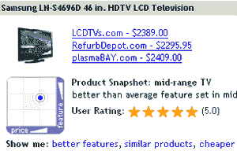

# Retrevo 的“快照”按价格和功能绘制产品图表

> 原文：<https://web.archive.org/web/http://www.techcrunch.com:80/2007/07/30/retrevos-snapshot-graphs-products-by-price-and-features/>

 [Retrevo](https://web.archive.org/web/20160911071314/http://www.crunchbase.com/company/retrevo) ，我们之前[报道过的](https://web.archive.org/web/20160911071314/http://www.techcrunch.com/2006/09/28/an-aggregate-review-of-aggregate-gadget-review-services/)的一个自动化、聚合评论网站，正在发布一个名为“产品快照”的新产品对比功能的 alpha 版本。该功能通过直观显示产品的价格和功能与同类产品的对比，有助于找到最“划算”的产品。首席执行官 Vipin Jain 将在明天的斯坦福峰会上演示该功能。该功能将于 9 月底上市。

“产品快照”映射了一个产品在价格/功能图上相对于该类别中其他产品的位置。该产品的地图是基于从网络上抽取的大量主要功能和价格的统计分析。价格上功能较少的产品位于图表的左下方，而价格高、功能多的产品位于右上方。例如，对三星 LN-S4696D 的[搜索](https://web.archive.org/web/20160911071314/http://alpha.retrevo.com/search?q=Samsung+LN-S4696D)会显示液晶电视相对于其他中档电视的位置。

快照还包括具有更好功能的产品、相似产品和更便宜产品的链接。这些功能将在 9 月底发布，届时将推出完整的功能。

Retrevo 的与众不同之处在于它专注于消费电子产品，并在产品上寻找大量的辅助材料。搜索返回 PDF 产品手册、聚合用户评级、产品预览、书面评论、论坛和博客以及购物链接。这些数据来自数千个网站，包括制造商和零售商的网站。Retrevo 的信息深度使其最适合于初始产品研究，而不是快速价格比较。