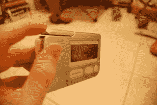
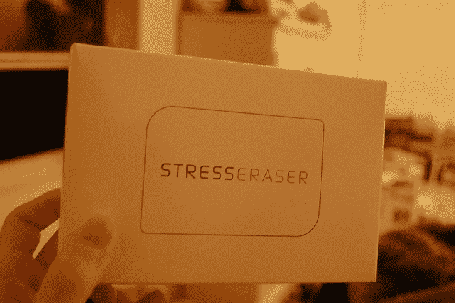
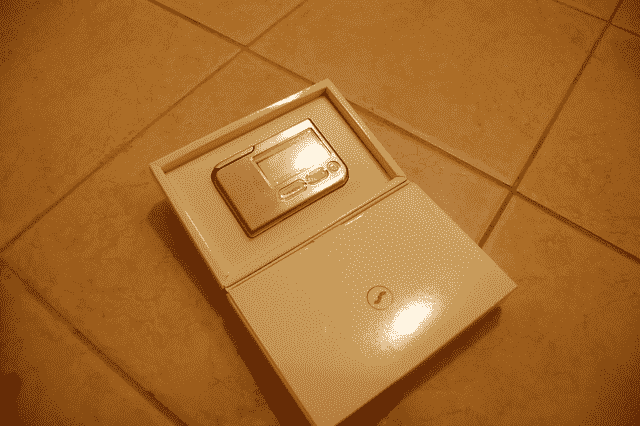
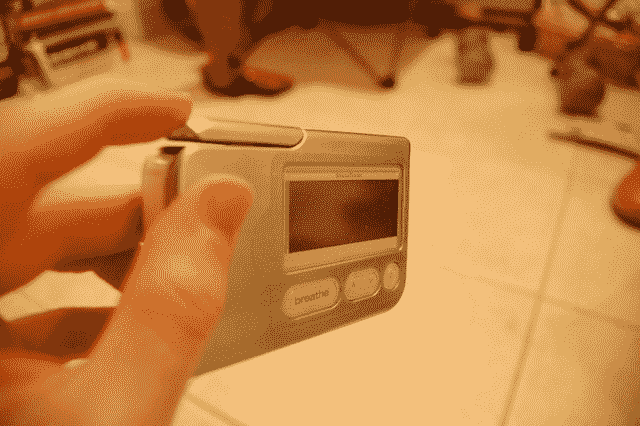
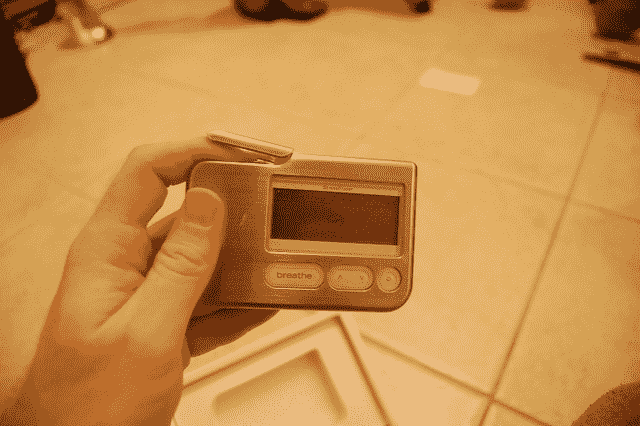

# Helicor StressEraser 激光生物反馈设备评论——TechCrunch

> 原文：<https://web.archive.org/web/http://techcrunch.com:80/2007/07/13/review-helicor-stresseraser-biofeedback-device/>

# Helicor 压力激光生物反馈装置综述

瑜伽大师和科学家都知道这一点，但如果你发现呼吸很困难，你可能需要放松呼吸。事实证明，通过调整你的呼吸模式，使你的呼气长而有规律，你可以激活你的神经系统的一部分(它被称为副交感神经系统)，使你保持平静，放松和无压力。

不幸的是，大多数人狼吞虎咽，不假思索地吐出空气。这就是 Helicor StressEaser 的用武之地。这是一个电池供电的生物反馈小工具，可以帮助你训练你的身体以一种真正消除压力的方式呼吸。

我得到了其中的一个，并通过绞拧它。点击跳转查看完整评论…

压力激光仪是一种生物反馈设备。也就是说，通过向你展示通常无意识的内部过程是如何工作的，它允许你专注于它们并施加一些控制。稍加练习，你就能越来越好地控制自己。通过大量的练习，缓慢放松的呼吸应该是毫不费力的。

该设备非常简单，可以随时使用——谢天谢地，它还配有一对必需的 AAA 电池。只要把它们放进去，打开它，你就可以开始了。

该设备的顶部向上翻转，刚好可以让你将食指伸进翻盖下。几秒钟后，这个小工具会记录下你的脉搏，到了该呼吸的时候了。当你吸气和呼气时，LCD 开始将你的呼吸模式绘制成一系列的波形——当你吸气时，曲线上升，当你呼气时，曲线下降。

这就变得棘手了:在图表中以规则的间隔分布着一系列小三角形。当一个新的三角形出现时，你要呼气。然后根据每次呼吸的成功程度给你打分。随着放松，缓慢，平静的呼气，你可以赢得三分。如果你更疯狂一点，你会得到更少。目标是每天使用该设备至少累积 30 分，如果在睡觉前使用，至少累积 100 分。

这个想法很简单:随着足够的平静诱导呼气，你应该准备好冷静下来或打干草。不再有焦虑的头脑或狂乱的心跳。

该设备实际上确实像宣传的那样工作——只是需要很大的耐心。收集 30 个积分可能需要 5 到 10 分钟，100 个可能需要长达半个小时。也许这有点过分，但是迅速完成它是做好这件事的一个很强的动力。

这无疑有助于他们把它变成一种游戏——尽管是最令人沮丧和重复的游戏之一。这让我想起了任天堂 ds 的*大脑时代*——坚持每天练习，你会发现自己变得更聪明/呼吸更轻松。问题是，你真的必须坚持下去。不幸的是，这里有一个悖论:能够每天使用它的冷静、耐心的人是最不需要它的人。299 美元，如果它最终被放在抽屉里，这是一个沉重的代价。感谢 30 天免费试用——你可能需要一半的时间来决定它是否适合你。

[$ 299 @ StressEraser.com](https://web.archive.org/web/20220504163745/http://www.stresseraser.com/)