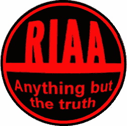

# RIAA 向 23 所大学发出恶意信件，拯救哈佛，索要资金

> 原文：<https://web.archive.org/web/http://techcrunch.com/2007/07/23/riaa-sends-nasty-letter-to-23-colleges-save-harvard-demanding-money/>

# RIAA 给拯救哈佛的 23 所大学发了封恐吓信，索要钱财

RIAA 继续为正义而战，将它的客户从饥饿和赤贫中拯救出来。它刚刚致信全国 23 所大学，要求下载音乐的战犯支付 3000 美元。除了让普通大学生获得一大笔钱之外，该计划还规定，如果你合作，RIAA 将掌握你所有的个人信息。一旦他们有了这些，就没有什么能阻止他们起诉你。

目标大学的名单不包括哈佛，可能是因为该校第一次公开使用如此严厉的语言，要求 RIAA“[管好自己的蜂蜡](https://web.archive.org/web/20211206063530/http://crunchgear.com/2007/07/11/harvard-really-hates-the-riaa/)”。抱歉，RPI，我想 RIAA 不会害怕惹你。

[RIAA 学生受害运动](https://web.archive.org/web/20211206063530/http://www.p2pnet.net/story/12855)【p2pnet.net via[sash dot](https://web.archive.org/web/20211206063530/http://yro.slashdot.org/article.pl?sid=07/07/23/0417223&from=rss)