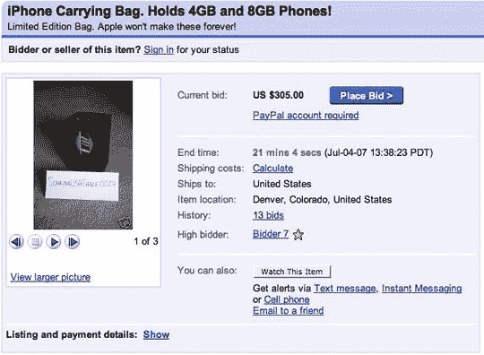

# 为 iPhone 包支付的现金多得离谱

> 原文：<https://web.archive.org/web/http://techcrunch.com/2007/07/05/ridiculous-amount-of-cash-paid-for-iphone-bag/>

# 为 iPhone 包支付的现金多得离谱

仅仅因为 iPhone 正式上市并不意味着随之而来的兴奋会戛然而止。不过，有了 iPhone 这种笨重的小玩意，我不认为人们会对自己紧身牛仔裤的口袋里塞满虚假的美好事物感到兴奋。要是有个包或什么东西可以装你的 iPhone 就好了…

啊哈！易贝的魔力又一次创造了奇迹。这个手工制作的 iPhone 包以 300 多美元的价格卖给了一些幸运的竞拍者，他们希望自己的 iPhone 装在一个定制设计的包里。我很确定你可以去任何一家[高档商场](https://web.archive.org/web/20130628185008/http://www.kingofprussiamall.com/)，找一家古驰或任何高档服装店，向他们要一个小包。很可能看起来一样，感觉也一样。只需打印出一张 iPhone 的照片，贴在上面，你就可以开始了。

[你愿意花多少钱买一个 iPhone 包？](https://web.archive.org/web/20130628185008/http://www.blogyoulikeahurricane.com/2007/07/how-much-would-you-pay-for-iphone-bag.html)【博客你喜欢飓风】