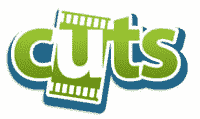

# Rifftrax 收购 Cuts

> 原文：<https://web.archive.org/web/http://www.techcrunch.com:80/2007/06/12/rifftrax-acquires-cuts/>

 自从[推出](https://web.archive.org/web/20211023031036/http://www.beta.techcrunch.com/2007/02/21/cuts-launches-amidst-online-video-editor-war/)大约四个月后，网络视频编辑[Cuts.com](https://web.archive.org/web/20211023031036/http://cuts.com/)被 Rifftrax 收购，这是一个以 [MST3K](https://web.archive.org/web/20211023031036/http://en.wikipedia.org/wiki/Mst3k) 的迈克尔·j·尼尔森的 DVD 评论为特色的网站。没有价格方面的消息。

在线视频编辑领域的竞争越来越激烈。Click.tv 最近[加入死池](https://web.archive.org/web/20211023031036/http://www.beta.techcrunch.com/2007/06/07/clicktv-player-joins-the-deadpool/)，计划重组。

在关于收购的博客文章中，首席执行官埃文·克劳斯说，自从 Rifftrax 成立以来，“它几乎接管了我们的网站”。这项收购可能会影响克劳斯之前提到的完整长度电影混音的长期计划。Cuts 不同于其他激怒好莱坞的电影编辑项目，因为它不改变底层电影，而是存储元数据，指导如何播放电影和叠加效果。收购后，Rifftrax 将运营 Cuts.com，计划增加功能和重新混合尼尔森评论的能力。