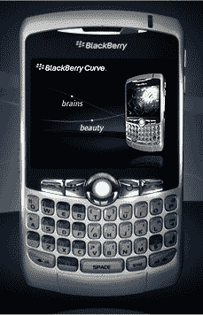

# 配备 GPS 的 RIM BlackBerry Curve 8310，此处不提供

> 原文：<https://web.archive.org/web/http://techcrunch.com/2007/07/31/rim-blackberry-curve-8310-equipped-with-gps-not-available-here/>

黑莓 Curve 是加拿大的热门机器，但我们在美国的 8320 缺乏每个人和他们的母亲似乎都渴望的 GPS。如果你真的想要 GPS，你可以选择 8800 系列，但是它稍微大一点，而且没有摄像头。极客能做什么？

RIM 今天在德国公布了 8310 曲线。你怎么能这样，瑞姆？你怎么能在德国发布启用 GPS 的曲线，而在美国却没有呢？至少我们可以感到欣慰的是，8310 可能会在今年的某个时候出现在我们的海岸上。新的 RIM 设备的突然袭击让我忙得团团转，但它节省了我的钱，因为我知道未来会有新的东西出现。呃。

对于观众中的德国沃达丰订户，您现在可以以 99 欧元的价格购买 8310。

[新闻稿](https://web.archive.org/web/20151002013320/http://www.rim.com/news/press/2007/pr-31_07_2007-02.shtml)