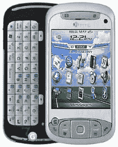

# RIM 将 BAS 引入 Windows Mobile

> 原文：<https://web.archive.org/web/http://techcrunch.com/2007/04/23/rim-bringing-bas-to-windows-mobile/>

# RIM 将 BAS 引入 Windows Mobile

神圣的托莱多！令人惊讶的是，RIM 今天宣布，它将把黑莓应用程序套件引入 Windows Mobile 6.0。基本上，这意味着你的 T-Mobile Dash、HTC Libra 和摩托罗拉 Q 不会再那么烂了。你将能够运行所有你喜欢的黑莓应用程序，包括文件浏览器、电子邮件和网络浏览器——基本上整个黑莓操作系统都运行在 WM6.0 之上。

最精彩的部分？RIM 正在开发这款软件，这样你就可以在黑莓应用和 Windows Mobile 应用之间即时切换。就像所有酷技术一样，美国电话电报公司在与 RIM 的交易中得到它肮脏的爪子，很可能会支持这一举动。你现在可以从你的办公椅上站起来大喊“是，是！”

[RIM 在 Windows Mobile 上模仿黑莓](https://web.archive.org/web/20210302021928/http://www.phonescoop.com/news/item.php?n=2173)