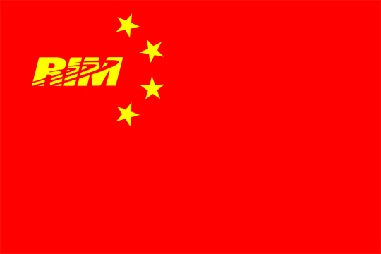

# RIM 进入紫禁城

> 原文：<https://web.archive.org/web/http://techcrunch.com:80/2007/07/06/rim-enters-forbidden-city/>

在与共产主义国家打交道时，坚持似乎是关键，RIM 对此非常清楚。毕竟，自从他们第一次向中国示好已经过去了 8 年，这个红色的州终于打开了大门。等着和别人上床的时间太长了，但我想中国值得。到 8 月底，RIM 将会以大约 700 美元的价格出售 8700g。他们已经收到了 5000 份预售订单，其中大部分来自外国跨国公司。如果 RIM 能够在中国开店，那么利润会更大，我们肯定会是受害最深的冤大头。我希望你把你的垃圾打包了，RIM。

[RIM 为黑莓打开中国市场](https://web.archive.org/web/20131031103505/http://www.theglobeandmail.com/servlet/story/LAC.20070704.RBLACKBERRY04/TPStory/Business)