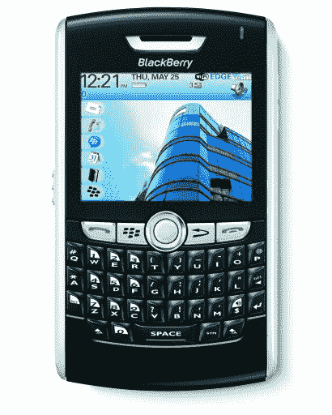

# RIM 正式推出 Wi-Fi 黑莓 8820

> 原文：<https://web.archive.org/web/http://techcrunch.com/2007/07/17/rim-officializes-wi-fi-blackberry-8820/>

# RIM 正式推出 Wi-Fi 黑莓 8820

RIM 正式宣布推出支持 Wi-Fi 的 8820，实现了我的梦想。它也是迄今为止最薄的黑莓手机，内置 GPS，通过 Roxio Media Manager 提供媒体播放器功能，A2DP/AVRCP 和最高可支持 32GB 的 microSD/SDHC 内存插槽。8820 还可以将自己标榜为第一款双模式 BB，它通过 802.11 a/b/g 将 EDGE/GPRS/GSM 和 Wi-Fi 连接与安全协议(包括 WEP、WPA、WPA2 和支持 VPN 访问的基于 IPSec 的软件)相结合。我说过它支持 UMA 吗？还能更好吗？我写这个的时候是不是尿裤子了？是啊！再见 Sidekick3，你好 8820。我可能会硬着头皮转到 AT&T. Gah。

[新闻稿](https://web.archive.org/web/20130628145609/http://www.marketwire.com/2.0/release.do?id=752132&sourceType=1)