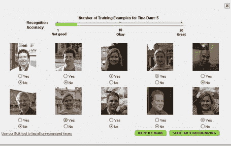
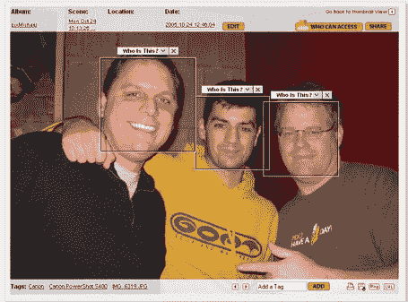

# Riya TechCrunch 的首批屏幕截图

> 原文：<https://web.archive.org/web/http://www.techcrunch.com:80/2005/10/26/riya-prepares-to-launch-alpha/>

明天早上，Riya (前身为 [Ojos](https://web.archive.org/web/20221017015811/http://www.beta.techcrunch.com/2005/10/20/ojos-is-now-riya/) )将向大约 10 名幸运的 alpha 测试者开放。

Riya 利用强大的面部和文本识别技术以及智能界面来帮助人们理解他们硬盘上(和网络上)积累的数以千计的无标题和无标签的照片。

我们之前在 2005 年 8 月 31 日的[介绍过 Riya(当时的 Ojos)](https://web.archive.org/web/20221017015811/http://www.beta.techcrunch.com/2005/08/31/ojos-auto-name-tag-your-photos/)

我今天去了 Riya 的办公室，和[团队](https://web.archive.org/web/20221017015811/http://www.riya.com/corp/team.jsp)见了面，看看他们的产品。据 Riya 的首席执行官 Munjal Shah 说，我是第一个有机会接触现场产品的局外人。考虑到 Riya 现在有多红，我认为这是一个巨大的荣誉。

这个过程从注册和选择图片的隐私设置开始。然后，您下载一个客户端应用程序，上传您选择包含在 Riya 中的照片。实际上传需要一段时间，每 GB 的照片大约需要 4 个小时。Riya 会在过程完成后给你发邮件，而不是等着。

这才是有趣的开始。我上传了大约 400 张照片。我看到了照片中每个人的面部缩略图。Riya 要求你通过告诉它这些人是谁来开始教育它……然后它很快开始以惊人的准确度自动标记图片。

Riya 还可以识别照片中的文本，并允许您选择照片的任何区域并进行标记。例如，你可以只选择照片中的埃菲尔铁塔，并将其标记为埃菲尔铁塔。片刻之间，我所有照片中所有重要的东西都被打上了标签。更重要的是，*它是可搜索的*。

这是一个简单的步骤，允许朋友也标记和搜索你的照片(如果你选择)，甚至允许完全公开搜索。

至少可以说，将这两个功能联系起来——使用搜索功能对照片中的所有内容进行大规模自动标记——是很有吸引力的。Riya 的人们称之为“本地标记，全球搜索”。

丽雅会成功的。他们有真正的技术。而且，当人们使用它来标记照片时，Riya 将创建一个人的独特属性的数据库。一旦有足够多的人开始使用这项服务，Riya 将能够在用户越来越少的训练下自动标记人们的名字。在这种情况下，为什么会有人尝试竞争服务呢？Riya 将拥有技术(受专利保护)和令人难以置信的网络效应。

Riya 计划建立一个免费的目的地网站，并将他们的服务外包给其他图片服务。像 flickr 这样的网站当然可以尝试复制 Riya 的服务，但是除非他们行动迅速，否则 Riya 的网络效应将是不可逾越的。

事实上，Riya 可能会变得无处不在，以至于引发真正的隐私问题。我今天问团队的一个问题是——“如果你获得了如此多的人的数据，以至于我可以拍一张人群的照片，上传到 Riya，并立即获得人群中每个人的名字，那会怎么样？”显然，他们的技术还没有那么强大——目前还没有。Riya 知道照片中的人是谁的能力很大程度上是基于你是谁和你联系的人。

要完全欣赏丽雅，你必须从视觉上去看它。我在下面贴了几张我今天早些时候使用它的截图。

[如果可以的话，进入丽雅阿尔法。这将是一项受欢迎的服务。](https://web.archive.org/web/20221017015811/http://www.riya.com/html_register.jsp)