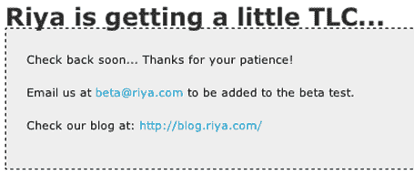

# Riya 将于今日发布

> 原文：<https://web.archive.org/web/http://www.techcrunch.com/2006/03/21/riya-to-launch-today/>

**更新:** Riya 今天不会发布公开测试版，但会向已经注册了 alpha 版的人发送电子邮件。几天后，Riya 将向所有人开放注册。更多关于他们的博客[这里](https://web.archive.org/web/20220327044355/http://blog.riya.com/blog/2006/03/riya_beta_is_re.html)。

  今天有传言称，漫长的[等待](https://web.archive.org/web/20220327044355/http://www.beta.techcrunch.com/2005/10/26/riya-prepares-to-launch-alpha/)，几乎[收购了](https://web.archive.org/web/20220327044355/http://www.beta.techcrunch.com/2005/12/18/google-passes-on-riya/)照片面部识别服务 [Riya](https://web.archive.org/web/20220327044355/http://www.riya.com/) 应该会在今天的某个时候退出私有 alpha 并推出公共 beta。[主站点](https://web.archive.org/web/20220327044355/http://www.riya.com/)目前关闭并“请求您的耐心”，这无疑暗示着*那边正在发生一些有趣的事情。*

Riya 是由 Blue Run Ventures、Leapfrog Ventures 和 Bay Partners 资助的，它是一种自动识别照片中的人并将他们分组的服务。给这个人添加一个标签，所有的照片都会用这个名字来标记。随着您的朋友和家人也加入 Riya，他们的许多照片也会自动标记您的数据(以及他们其他朋友的数据)。

Riya 是一家我从一开始就喜欢的公司(截屏[这里是](https://web.archive.org/web/20220327044355/http://www.beta.techcrunch.com/2005/10/26/riya-prepares-to-launch-alpha/))，甚至当它还叫做 [Ojos](https://web.archive.org/web/20220327044355/http://www.beta.techcrunch.com/2005/10/20/ojos-is-now-riya/) 的时候，我就经常写关于它的文章。祝贺整个 Riya 团队，事实上，正如我被非正式告知的那样，它将于今天发布。我真的希望他们采取合作策略，并把这种策略融入到 Flickr 和其他照片分享服务中。或者至少建立一个导入器，这样我就可以把我的照片传给他们了。雅虎，如果 Riya 成功了(在我的 beta 测试中它确实成功了)，请买下这家公司。