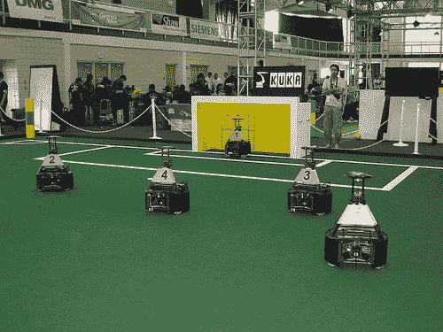

# 机器人足球赛:机器人踢足球，美国仍然讨厌这项运动

> 原文：<https://web.archive.org/web/http://techcrunch.com/2007/07/09/robocup-robots-play-soccer-america-still-hates-the-sport/>

虽然像我这样的现实生活中的足球流氓满足于观看[美洲杯](https://web.archive.org/web/20140820034732/http://en.wikipedia.org/wiki/Copa_Am%C3%A9rica_2007)进行他们的夏季足球比赛，但几个书呆子认为让机器人玩这场漂亮的比赛是个好主意。因此，我们有了机器人世界杯，这是佐治亚理工学院主办的机器人和为了推进机器人领域而建造(和喜爱)机器人的书呆子们的节日。虽然足球不是机器人参与的唯一运动或活动，但它显然是最好的。不仅仅是因为我偏爱这项运动，还因为这是展示机器人机动性等等的最佳方式。想象一下，一个机器人梅西[撕破](https://web.archive.org/web/20140820034732/http://crunchgear.com/2007/07/05/ea-family-play-dumbs-down-wii-controls-so-grandpa-can-play/)一个机器人赫塔菲的防守。就像雷·哈德森说的，魔法！

RoboCup 的最后一天是明天，所以现在就下注吧。

机器人世界杯通过美联社/雅虎。