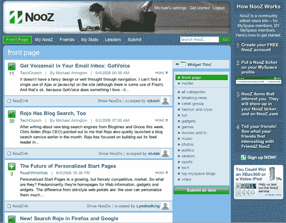

# 罗约为 Myspace TechCrunch 推出 Nooz

> 原文：<https://web.archive.org/web/http://www.techcrunch.com:80/2006/06/04/rojo-launches-nooz-for-myspace>

  周一，将推出针对 Myspace 用户(以及未来其他社交网络)的互动新闻服务。新产品名为 [Nooz](https://web.archive.org/web/20230218044509/http://www.nooz.com/) ，将利用罗约开发的技术，但不会以罗约品牌命名。

当我与罗约首席执行官克里斯奥尔登谈论 Nooz 时，他强调说，它是专门为 Myspace 人群设计的，而罗约的目标是极客/早期采用者人群。

有三个关键特征。首先，Myspace 用户可以在 Nooz 上建立一个账户，并直接链接到他们的 Myspace 个人资料。在 Nooz，用户可以按类别查看博客和其他 RSS 新闻条目，并对它们进行评级(这利用了类似 Digg 的[罗约 Mojo](https://web.archive.org/web/20230218044509/https://techcrunch.com/2006/03/16/rojo-gets-relevant/) 功能)。一条新闻获得的投票越多，它在特定类别中的排名就越高。新的故事也可以使用书签功能提交。

第二，用户可以查看他们的 Myspace 好友提交或投票的新闻条目。

第三，用户可以创建一个 Flash 小部件，放在他们的 Myspace 页面(或任何网页——见下面的小部件)上，列出他们投票的新闻故事。或者，小部件可以显示一个纯 RSS 提要，尽管点击一个新闻条目会在 Nooz 中显示帖子，而不是在原始站点上)。

[http://www.nooz.com/static/widget/nooz/noozlist.swf](https://web.archive.org/web/20230218044509/http://www.nooz.com/static/widget/nooz/noozlist.swf)

Myspace 当然也被咨询过 Nooz 产品。**我查看了福克斯互动公司(Myspace 的母公司)总裁罗斯·莱文索恩的 Myspace 页面，他的页面上突出显示了一个 Nooz 插件。**这可能是也可能不是对 Nooz 的认可——但这肯定表明 Fox 团队了解该产品并正在测试它。我注意到 Ross 的网站上没有任何其他第三方插件。

最近推出了一批 Myspace 的第三方插件(例如，见 [Tagworld 插件](https://web.archive.org/web/20230218044509/https://techcrunch.com/2006/06/02/tagworld-widgets-platform/)和 [MyPickList](https://web.archive.org/web/20230218044509/https://techcrunch.com/2006/05/24/my-pick-list-adds-myspace-widget/) )。我不认为这些服务是对 Myspace 过度迷恋的标志，而只是意识到，拥有近 8000 万会员的 Myspace 本身就是一个完整的经济体。公司将找到一种方式，尽可能深入地参与到经济中，提供更加定制化的产品。

