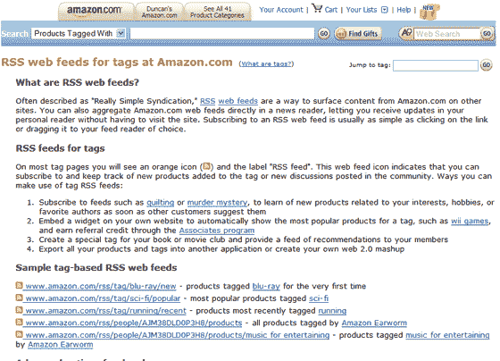

# Amazon.com 的标签 RSS 源——TechCrunch

> 原文：<https://web.archive.org/web/http://www.techcrunch.com:80/2007/05/08/rss-feeds-for-tags-at-amazoncom/>

# Amazon.com 标签的 RSS 源

根据亚马逊的伊恩·麦卡利斯特的帖子[，亚马逊的客户社区团队已经推出了对基于标签的 RSS 订阅源的更广泛支持。](https://web.archive.org/web/20220629011030/http://ianmcallister.spaces.live.com/blog/cns!AFAD344C48A05587!1373.entry)

这项新功能已经试运行，目前还不能在亚马逊的所有页面上使用。未来几周将全面提供支持。

该选项允许订阅特定于用户兴趣的提要，随后还允许使用创建的数据创建小部件和混搭。

对于那些使用 Amazon Associates 计划的用户，基于标签的 feeds 也支持会员链接。

新提要的例子可以在[这里](https://web.archive.org/web/20220629011030/http://www.amazon.com/gp/tagging/rss-help.html)找到。

