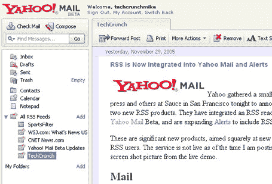

# RSS 现已集成到雅虎邮箱和 Alerts TechCrunch 中

> 原文：<https://web.archive.org/web/http://www.techcrunch.com:80/2005/11/29/rss-is-now-integrated-into-yahoo-mail-and-alerts/>

今晚，雅虎在旧金山的 Sauce 召集了一小群博客作者、媒体和其他人，宣布推出两款新的 RSS 产品。他们已经将 RSS 阅读器直接集成到雅虎邮箱的测试版中，并且正在扩展[提醒](https://web.archive.org/web/20221001134950/http://alerts.yahoo.com/)以包括 RSS 订阅。

这些都是重要的新产品，直接面向新的和主流的 RSS 用户。在我发表这篇文章的时候，这项服务还没有上线。我添加了一个现场演示的截屏图片。

## 邮件

雅虎已经将 RSS 深度整合到雅虎邮箱测试版体验中。电子邮件文件夹的正下方是“RSS 文件夹”。点击顶部的文件夹以“新闻河”的格式显示所有帖子，这意味着所有订阅源的所有帖子都按照它们在源中出现的顺序列出。

每个提要也有自己的文件夹，允许用户单独阅读提要(更像 bloglines)。

来自任何订阅源的帖子都被视为电子邮件——任何帖子都可以作为电子邮件转发或拖到文件夹中保存。雅虎邮件测试版中所有优秀的 AJAX 功能都可以与新的 RSS 功能兼容。

添加提要很简单——包括提要 URL 或从大量流行提要中选择。

## 警报

Yahoo 用户现在可以使用 Yahoo Alerts 在 RSS 源更新时得到通知。包括更新内容摘要的警报可以配置为通过 sms、电子邮件和/或 messenger 发送。这是监视小组重要提要的一个很好的方法。

雅虎显然在今晚的最佳电子邮件应用中遥遥领先。“插入”其他电子邮件帐户的能力、ajax 功能以及现在集成的 RSS 阅读器绝对是令人惊叹的功能。

John Furrier 也出席了今晚的活动，和往常一样，他有一个独家播客。

更新:雅虎邮箱中的 RSS 现在已经全面上线。正如杰夫·克拉维尔所说，我的雅虎和雅虎邮箱是同步的——电子邮件中的长列表在我的雅虎上不太好用。今晚早些时候，我和雅虎的斯科特·盖兹谈过这个问题，他说他们会找到解决办法。还有一些其他的功能需要添加，但是雅虎邮箱是一个非常棒的产品。

