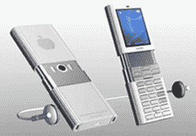

# 谣言:iPhone 固件升级即将到来

> 原文：<https://web.archive.org/web/http://techcrunch.com/2007/07/10/rumor-iphone-firmware-upgrade-coming-soon/>

今天的移动性似乎拥有 iPhone 首次固件升级时将修复或添加的一系列功能的独家新闻。谁也说不准升级什么时候会出现。名单很长，但情报提供者对一款文件浏览器非常感兴趣:

> 因此，无论如何，一个完整的文件浏览器即将到来，这样你就可以像 windows mobile explorer 一样浏览，只不过是以 leopard 的文件浏览器的酷方式

随着 iChat、铃声和 Flash 等功能的增加，列表的其余部分似乎相当明显。这个名单准确吗？有可能，但是所有的谣言，我们将不得不玩弄我们的拇指直到它出现。请继续阅读完整列表。

> *将有一个内置的文件浏览器，如 leopard 中用于整理文件的新 finder
> *将有一个磁盘模式
> *目前没有文件浏览器+从 web 保存文件的方法的原因是因为手机上没有文件浏览器，他们希望在即将发布的 leopard 操作系统中发布相同的浏览器，并配有 coverflow。
> *甚至会有一个特殊版本的“iWork”，这样你就可以展示你的 keynote 演示文稿
> *总之，一个完整的文件浏览器即将推出，这样你就可以像 windows mobile explorer 一样以很酷的方式浏览了。leopard 的文件浏览器是
> *完整的 spotlight like search 也即将推出
> *宽屏键盘支持将出现在每个应用程序中，而不仅仅是 safari
> * Copy & Paste，Select Text 也即将推出(clipboard)
> * mail 也将看到一个升级，这样你就可以添加帐户，而不必通过 itunes 这样做。
> *这方面的大部分延迟是因为 iTunes 是 Windows & Mac 用户熟悉的 iTunes 应用程序，所以苹果不想做一个糟糕的界面，让文件浏览器侵入 iTunes。
> *当 Leopard 最终版本发布时，插入 iPhone 将在 finder 中弹出一个特殊窗口，该窗口中有一些区域可以拖动所有文件，就像一个文件浏览器一样，只是更高级，专为 iPhone 设计，它将确保它能够工作，以便 iTunes 知道有多少空间用于数据，有多少空间用于“iTunes”内容。
> *苹果将在手机上安装 iChat，非常非常快，先于 Leopard。
> *真正的应用即将出现在手机上。
> *这些都是基于你已有的 iPhone 软件的更新，所以给它一点时间。同时享受它已经拥有的功能。
> *哦，还有照片共享，就像 iPhoto 一样，你可以选择让网络上的其他人查看你的照片。
> *他说。Mac 帐户最终会将您的帐户同步到。Mac 服务器以及电话，等等。
> *通过 bonjour(自动 ip 发现)在 WIFI 网络上简化文件共享即将到来，因此一旦文件系统软件启动，您在同一房间的好友将能够导航到他的文件浏览器>网络，并从您的手机上抓取您正在共享的文件。
> *铃声很快就会响起。
> *相机软件将很快升级，以实现稳定性(基于软件)
> * Flash 最终会到来，这只是一个以某种方式处理它的问题，因此当我的页面同时运行几十个 Flash 应用程序时，页面不会慢得像爬行一样，所以他们必须使用 Adobe flash 并进行一些定制，包括安全性。无论如何，现在就享受伟大的手机吧，期待所有伟大的东西真的真的很快到来。我等不及新的文件浏览器了，这样我就可以在这个设备上存储东西了！！
> 
> 请记住，Windows Mobile 已经问世很长时间了，即使每次新的 WM 手机问世，所有应用程序都必须进行调整或不适合屏幕或一些废话，所以要意识到这只是苹果首次发布的手机操作系统。苹果商店里为你们所有人准备了很多好吃的东西
> 
> 不要担心张贴这也…

[线人告诉我们 iPhone 固件升级列表..](https://web.archive.org/web/20151002193912/http://mobilitytoday.com/news/007803/tipster_firmware_upgrade)【今日移动】