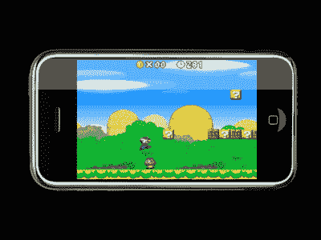

# 传言传言:任天堂将在 iTunes 上销售可在 iPhone 上使用的视频游戏

> 原文：<https://web.archive.org/web/http://techcrunch.com:80/2007/06/19/rumor-rumor-rumor-nintendo-to-sell-video-games-on-itunes-for-use-on-iphone/>

# 传言传言:任天堂将在 iTunes 上销售可在 iPhone 上使用的视频游戏

这里有一个有趣的，如果不是完全没有来源的谣言，关于下午三点左右的低迷。NoHeat 上的一篇报道称，任天堂正在考虑为 iPhone 发布一些视频游戏。这些游戏售价 29.00 美元，已经比虚拟主机[上的大多数游戏都要贵，并将在 iTunes 商店](https://web.archive.org/web/20210121115210/http://crunchgear.com/2007/04/30/trouble-in-wii-world-virtual-console-sales-slowing/)[上销售。这份报告提出了用 iPhone 的控制键来控制游戏有多难。我提出这个想法听起来有多愚蠢。](https://web.archive.org/web/20210121115210/http://crunchgear.com/2007/04/03/get-a-60-itunes-card-for-45/)

我告诉你:如果这个谣言被证实，我会吃掉我的帽子。不开玩笑。

[任天堂和苹果合作开发 iPhone 游戏](https://web.archive.org/web/20210121115210/http://www.noheat.com/2007/06/18/nintendo-and-apple-to-partner-on-games-for-iphone/)【no heat via[MAC daily news](https://web.archive.org/web/20210121115210/http://macdailynews.com/index.php/weblog/comments/13960/)